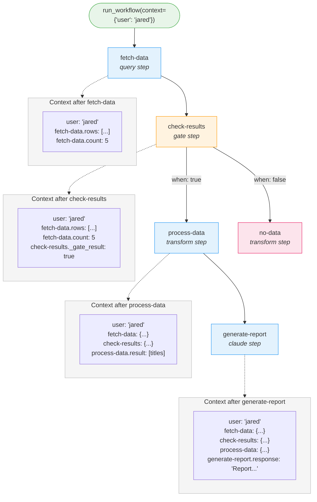

# Context and Data Flow

How data moves between steps in a liteflow workflow: context accumulation, template substitution, and special data-flow patterns like fan-out/fan-in.

---

## The Context Model

Context is a single Python dict that accumulates as the workflow runs. Every step in the DAG can read from it, and every step's output is merged back into it.

- **Starts** with the initial context passed to `run_workflow()`:

  ```python
  engine.run_workflow("my-workflow", context={"user": "jared", "repo": "liteflow"})
  ```

- **Grows** after each step completes -- the step's output dict is merged under its step ID key.

- **Downstream steps see everything** -- all prior step outputs plus the original context.

This design means steps are loosely coupled. A step does not need to know which specific step produced a value; it only needs to know the key path.

---

## Context Accumulation

The function `state.get_run_context()` rebuilds the accumulated context at any point during (or after) a run:

1. Load the initial run context from the `runs` table (the `context` column, stored as JSON).
2. Query all `step_runs` with `status="completed"`, ordered by `started_at`.
3. For each completed step run, parse the `output` JSON and merge it into the context under the step's ID:
   ```python
   context[step_run["step_id"]] = json.loads(step_run["output"])
   ```
4. Return the merged context dict.

The engine calls this at the start of each step execution, so every step receives a context that reflects all prior work.

### Example: Context Evolution Through a 3-Step Workflow

```
Initial context (passed to run_workflow):
{
  "user": "jared",
  "repo": "liteflow"
}

After "fetch-data" completes (a query step returning rows):
{
  "user": "jared",
  "repo": "liteflow",
  "fetch-data": {
    "rows": [{"title": "Bug fix", "status": "open"}],
    "count": 1
  }
}

After "transform-data" completes (a transform step):
{
  "user": "jared",
  "repo": "liteflow",
  "fetch-data": {
    "rows": [{"title": "Bug fix", "status": "open"}],
    "count": 1
  },
  "transform-data": {
    "result": "summary"
  }
}

After "summarize" completes (a claude step):
{
  "user": "jared",
  "repo": "liteflow",
  "fetch-data": {
    "rows": [{"title": "Bug fix", "status": "open"}],
    "count": 1
  },
  "transform-data": {
    "result": "summary"
  },
  "summarize": {
    "response": "Here is your report..."
  }
}
```

Each step adds its output under its own ID. Nothing is overwritten; the context only grows.

---

## Template Substitution

The `_template(text, context)` function in `steps.py` replaces `{variable}` placeholders with values from the context.

### Pattern

```
\{([a-zA-Z0-9_.:-]+)\}
```

Placeholders can contain letters, digits, dots, underscores, colons, and hyphens -- supporting dot-path access into nested structures.

### Resolution

Each placeholder is resolved via `StepContext.get()` using dot-path traversal:

| Placeholder | Resolves to | Explanation |
|---|---|---|
| `{user}` | `"jared"` | Top-level key |
| `{fetch-data.count}` | `5` | Step output, one level deep |
| `{fetch-data.rows.0.title}` | `"Bug fix"` | List index, then key |
| `{unknown.key}` | `{unknown.key}` | Unresolved -- left as-is |

Unresolved placeholders are left in the string unchanged. This is intentional: it avoids silent data loss and makes debugging easier.

### Where Substitution Is Applied

Template substitution runs on these fields before execution:

- **Claude steps**: the `prompt` string and string values inside the `flags` dict
- **Shell steps**: inline `command` strings and `args` list entries (file mode)
- **HTTP steps**: `url`, `endpoint`, and `body` (both string and dict forms)
- **Query steps**: `sql` and `database` path
- **Script steps**: not applicable (context is passed as JSON via stdin)

### Where Substitution Is NOT Applied

- **Transform expressions** -- these use `eval()` with direct `context` access
- **Gate conditions** -- these also use `eval()` with direct `context` access
- **Edge condition expressions** -- evaluated with `eval()` in the engine

The distinction matters: template substitution produces strings, while eval expressions can work with native Python types (lists, dicts, numbers, booleans).

---

## The StepContext Helper

`StepContext` is a class in `lib/helpers.py` that wraps the raw context dict with convenience methods for dot-path access, key validation, and output merging.

```python
ctx = StepContext(context)

# Dot-path access with default
ctx.get("fetch-data.rows.0.title")           # => "Bug fix"
ctx.get("missing.key", default="unknown")     # => "unknown"

# Require keys (raises KeyError with helpful message)
ctx.require("fetch-data", "user")             # passes
ctx.require("slack.channel")                  # KeyError: "Required context keys missing:
                                              #   slack.channel. Available top-level keys:
                                              #   fetch-data, user, ..."

# Merge step output
ctx.merge("my-step", {"result": 42})          # ctx.data["my-step"] = {"result": 42}

# Export back to plain dict
ctx.to_dict()                                 # returns a plain dict copy
```

### Dot-Path Resolution Rules

The `get()` method walks the path segment by segment:

- If the current value is a **dict**, the segment is used as a key lookup.
- If the current value is a **list or tuple**, the segment is parsed as an integer index.
- If the segment does not match (missing key, invalid index, wrong type), the `default` is returned.

This means `{fetch-data.rows.0.title}` traverses: dict key `fetch-data` -> dict key `rows` -> list index `0` -> dict key `title`.

---

## Shell Step Environment Variables

Shell steps inject context values into the subprocess environment using a `LITEFLOW_` prefix. This lets shell scripts access context without parsing JSON.

### Variables Set

| Variable | Value |
|---|---|
| `LITEFLOW_RUN_ID` | The current run ID |
| `LITEFLOW_CONTEXT` | Full context dict serialized as a JSON string |
| `LITEFLOW_{KEY}` | For each **scalar** top-level context value (str, int, float, bool), uppercased |

Nested dicts and lists are not flattened into individual variables -- use `LITEFLOW_CONTEXT` with `jq` or similar for those.

### Example

Given context `{"user": "jared", "count": 5, "fetch-data": {"rows": [...]}}`:

```bash
echo $LITEFLOW_RUN_ID       # abc123def456
echo $LITEFLOW_USER          # jared
echo $LITEFLOW_COUNT         # 5
echo $LITEFLOW_CONTEXT       # {"user":"jared","count":5,"fetch-data":{"rows":[...]}}

# Nested values require JSON parsing:
echo $LITEFLOW_CONTEXT | jq '.["fetch-data"].rows[0].title'
```

Note that `fetch-data` is a dict, not a scalar, so it does not get its own `LITEFLOW_FETCH-DATA` variable. Only scalar top-level values are promoted to individual environment variables.

---

## Transform and Gate Expressions

Transform and gate steps use restricted `eval()` instead of template substitution. This gives them access to native Python types and operations.

### Available in the Eval Scope

| Name | Description |
|---|---|
| `context` | The full context dict |
| `ctx` | A `StepContext` wrapper around the context |
| `json` | The `json` standard library module |
| `len`, `str`, `int`, `float`, `bool` | Type constructors |
| `list`, `dict`, `tuple` | Collection constructors |
| `sorted`, `reversed` | Ordering functions |
| `min`, `max`, `sum` | Aggregation functions |
| `any`, `all` | Boolean aggregation |
| `zip`, `enumerate`, `range` | Iteration helpers |
| `abs`, `round` | Numeric functions |
| `True`, `False`, `None` | Constants |

No other builtins are available. File I/O, imports, and attribute access on arbitrary objects are blocked.

Additionally, all top-level context keys are injected as local variables. This means if your context has `{"user": "jared"}`, you can reference `user` directly in the expression (in addition to `context['user']`).

### Transform Example

A transform step that extracts titles from query results:

```json
{
  "type": "transform",
  "expression": "[r['title'] for r in context['fetch-data']['rows']]"
}
```

The return value is wrapped: if the expression evaluates to a dict, it is returned directly. Otherwise it is wrapped as `{"result": <value>}`.

### Gate Example

A gate step that checks whether any rows were returned:

```json
{
  "type": "gate",
  "condition": "len(context['fetch-data']['rows']) > 0"
}
```

The condition is coerced to a boolean. The gate returns `{"_gate_result": True}` or `{"_gate_result": False}`, which the engine uses to decide which outbound edges to follow (edges with `when: "true"` or `when: "false"` conditions).

### Using the StepContext Helper in Expressions

Since `ctx` is available, you can use dot-path access in expressions:

```json
{
  "type": "gate",
  "condition": "ctx.get('fetch-data.count', default=0) > 10"
}
```

---

## Fan-Out/Fan-In Data Flow

Fan-out and fan-in steps use special context keys injected by the engine to coordinate parallel processing.

### Fan-Out: Splitting Work

When a fan-out step executes, it returns `_fan_out_items` -- a list of item dicts. The engine then enqueues the next step once per item, injecting metadata into each copy's context:

| Key | Type | Description |
|---|---|---|
| `_fan_out_step` | str | ID of the fan-out step that spawned this execution |
| `_fan_out_total` | int | Total number of items being processed |
| `_fan_out_index` | int | This item's index (0-based) |
| *(item_key)* | any | The item data, under the key configured by `item_key` (default: `"item"`) |

Example: a fan-out step configured with `"over": "fetch-data.rows"` and the default `item_key` produces context like:

```json
{
  "user": "jared",
  "item": {"title": "Bug fix", "status": "open"},
  "_fan_out_step": "split-issues",
  "_fan_out_total": 3,
  "_fan_out_index": 0
}
```

### Fan-In: Collecting Results

After all fanned-out items complete, the engine collects their outputs and populates:

| Key | Type | Description |
|---|---|---|
| `_fan_in_results` | list | Array of output dicts from all completed fan-out items |

The fan-in step can then aggregate these results. If a `merge_key` is configured, the fan-in executor extracts that key from each result:

```json
{
  "type": "fan-in",
  "merge_key": "summary"
}
```

This would produce `{"results": ["summary1", "summary2", ...], "count": 3}` instead of returning the full output dicts.

### Fan-Out Completion Detection

The engine tracks fan-out completion by counting completed `step_runs` for the processing step against `_fan_out_total`. Only when all items have completed does the engine:

1. Collect all outputs into `_fan_in_results`.
2. Remove fan-out metadata (`_fan_out_step`, `_fan_out_total`, `_fan_out_index`) from the context.
3. Enqueue successor steps with the merged context.

---

## Data Flow Diagram

The following diagram shows context state at each stage of a 4-step workflow with conditional branching:



The context grows monotonically -- each step adds its output without removing anything. The gate step's `_gate_result` determines which branch executes, but both branches would see the same accumulated context up to that point.

---

## See Also

- [Architecture](architecture.md) -- system overview and module relationships
- [Workflows and DAGs](workflows-and-dags.md) -- how workflows and steps are modeled as graphs
- [Execution Engine](execution-engine.md) -- the run loop, queue mechanics, and error handling
- [Step Types Reference](../reference/step-types/index.md) -- configuration for each step type
- [Module Reference](../reference/modules/index.md) -- API details for `StepContext` and other helpers
- [Documentation Home](../index.md)
