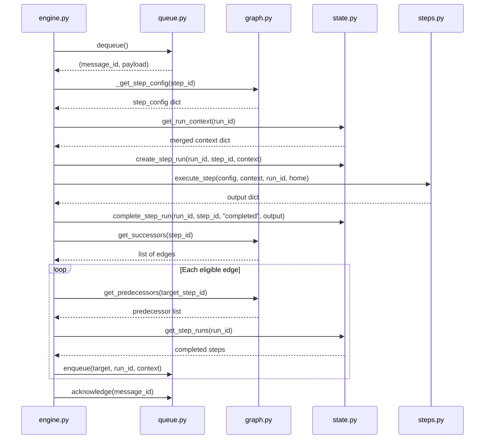

# The Execution Engine

The engine (`lib/engine.py`, class `LiteflowEngine`) orchestrates workflow execution through a queue-driven loop. It is not a daemon -- each invocation runs a workflow to completion and exits. There is no background process, no scheduler, and no event loop. You call `run_workflow()`, it processes every step in the DAG, and it returns.

The key entry point is:

```python
run_id = engine.run_workflow(workflow_id, context=None, dry_run=False)
```

It returns a 12-character hex string (`run_id`) that uniquely identifies this execution. Use this ID to inspect results, query step outputs, and debug failures.

---

## The Run Loop

The core of the engine is `_run_loop(run_id, dry_run)`. Here is exactly what happens from the moment you call `run_workflow()` until execution finishes.

### 1. Startup

`run_workflow()` performs four things before the loop begins:

- **Validate** that the workflow exists in the graph database. Raises `ValueError` if not found.
- **Generate** a `run_id` from `uuid.uuid4().hex[:12]`.
- **Create a run record** in the execution database with status `running`.
- **Find entry steps** -- steps with no inbound edges. These are the roots of the DAG. If none exist, the run is marked `failed` immediately.
- **Enqueue all entry steps** into the litequeue with the initial context.

### 2. Dequeue

Pop the next message from the queue. If the queue is empty, the loop ends and the run completes successfully.

### 3. Filter

Each message carries a `run_id`. If it does not match the current run, acknowledge it and continue to the next message. This prevents cross-contamination when the queue database is shared.

### 4. Load Config

Call `_get_step_config(step_id)` to read the step's node from the graph database. This queries the `nodes` table directly and returns the step configuration dict (type, command, on_error, etc.). If the config is missing, log an error and skip.

### 5. Build Context

Call `state.get_run_context(run_id)` to merge the initial context with all completed step outputs accumulated so far. Then merge any additional context passed in the queue message payload. The result is a single dict that the step can read from.

### 6. Execute

Call `execute_step(step_config, context, run_id, liteflow_home)` which dispatches to the appropriate executor in `steps.py` based on the step's `type` field. The step runs synchronously and returns an output dict.

### 7. Process Output

Three paths depending on what the step produced:

- **Normal step**: Evaluate edge conditions on all outbound edges. For each edge that passes, check the predecessor gate, then enqueue the successor.
- **Fan-out**: If the output contains `_fan_out_items`, call `_handle_fan_out()` to enqueue N copies of each successor with per-item context.
- **From fan-out**: If the current context contains `_fan_out_step`, this step was spawned by a fan-out. Call `_check_fan_out_complete()` to see if all parallel items are done. If so, collect results and enqueue successors with `_fan_in_results`.

### 8. Error Handling

If the step raises an exception, apply the error policy from the step config (`on_error`). See [Error Policies](#error-policies) below.

### 9. Acknowledge

Always acknowledge the queue message in a `finally` block, regardless of success or failure. This prevents the same message from being reprocessed.

### 10. Repeat

Continue until the queue is empty or the 1000-iteration safety limit is reached.

### Sequence Diagram

The following diagram shows the interactions between modules during one iteration of the run loop:



---

## Edge Evaluation

`_evaluate_edge(edge, context, step_output)` decides whether to follow an outbound edge after a step completes.

**No conditions**: If the edge has no `conditions` dict (or it is empty), the edge is always followed.

**Gate-based conditions** (used with gate steps):

| `when` value | Follows edge if... |
|---|---|
| `"true"` | `step_output["_gate_result"]` is `True` |
| `"false"` | `step_output["_gate_result"]` is `False` |
| `"always"` | Always (unconditional) |

If `when` is present and `_gate_result` does not match, the edge is not followed.

**Expression conditions**: If `conditions` contains an `"expression"` key, the engine evaluates it using a restricted `eval()` with safe builtins (`len`, `str`, `int`, `float`, `bool`, `any`, `all`, `True`, `False`, `None`) and the full context dict plus a `StepContext` wrapper as `ctx`. The expression must return a truthy value for the edge to be followed. On any exception, the edge is not followed.

```python
# Example edge condition
{"expression": "len(ctx.get('results.items')) > 0"}
```

---

## Predecessor Gating

`_all_predecessors_done(run_id, target_step_id)` prevents premature execution of convergence points -- steps where multiple branches of the DAG rejoin.

- **Entry steps or single predecessor**: Always returns `True`. No waiting needed.
- **Multiple predecessors**: Queries all inbound edges via `graph.get_predecessors()`, then checks `state.get_step_runs()` for the current run. Every predecessor must have a step_run with status `completed`. If any predecessor is missing, returns `False` and the step is not enqueued yet.

This check runs every time an edge evaluation passes. The first predecessor to complete will attempt to enqueue the convergence step, find that other predecessors are not done, and skip it. Only the last predecessor to complete will successfully enqueue the step.

---

## Fan-Out Handling

### Producing fan-out items

When a step's output contains `_fan_out_items` (a list of dicts), the engine calls `_handle_fan_out(run_id, step_id, items, context, logger)`:

1. Look up all successor edges of the fan-out step.
2. For each successor edge, for each item in the list:
   - Copy the current context.
   - Merge the item's data into the copy.
   - Add tracking metadata: `_fan_out_step` (origin step ID), `_fan_out_total` (item count), `_fan_out_index` (zero-based position).
   - Enqueue the successor with this per-item context.

If the fan-out step has no successors, a warning is logged and nothing is enqueued.

### Collecting fan-in results

After a fanned-out step completes, the engine calls `_check_fan_out_complete(run_id, step_id, context)`:

1. Read `_fan_out_step` and `_fan_out_total` from the context.
2. Count completed step_runs for this `step_id` in the current run.
3. If the count is less than `_fan_out_total`, return `None` -- more items are still running. The engine does nothing and waits.
4. When the count reaches `_fan_out_total`:
   - Collect each completed step_run's output into a list.
   - Build a merged context with `_fan_in_results` set to the collected outputs array.
   - Strip fan-out metadata (`_fan_out_step`, `_fan_out_total`, `_fan_out_index`).
   - Return the merged context. The engine then enqueues successors with this context.

---

## Error Policies

Three policies, set via `on_error` in the step configuration:

| Policy | Behavior | When to Use |
|--------|----------|-------------|
| `fail` (default) | Propagate the exception, mark the run as failed, stop execution. | Critical steps where failure should halt the workflow. |
| `retry` | Re-enqueue the step up to `max_retries` (default 3). The engine counts failed step_runs for that step and increments the attempt. If retries are exhausted, the error propagates like `fail`. | Transient failures: API timeouts, rate limits, temporary network issues. |
| `skip` | Mark the step as failed but enqueue all successors anyway. Execution continues as if the step had succeeded (though its output is empty). | Non-critical steps: notifications, logging, analytics. |

Example step config with retry:

```json
{
  "type": "http",
  "on_error": "retry",
  "max_retries": 5,
  "url": "https://api.example.com/data"
}
```

---

## Dry-Run Mode

When `run_workflow()` is called with `dry_run=True`:

- Steps are **not executed**. No side effects occur.
- The engine logs `DRY RUN: Would execute step '<step_id>' (type=<type>)` along with the current context keys.
- Successors are still enqueued. This means the dry run traverses the entire reachable graph, giving you visibility into the full execution path.
- Edge conditions are not evaluated during dry run -- all successors are enqueued unconditionally.

Dry-run is useful for:
- Validating that a workflow's DAG structure is correct before running it for real.
- Checking that template variables resolve to the expected context keys.
- Verifying that entry steps and edge connections are wired correctly.

---

## Run States

### Run lifecycle

```
running --> completed    (all steps finished successfully)
running --> failed       (a step failed with "fail" policy, or retries exhausted)
```

### Step lifecycle

```
running --> completed    (step returned output successfully)
running --> failed       (step raised an exception)
running --> skipped      (step failed but "skip" policy was applied)
```

Step runs carry an `attempt` counter that increments on each retry. The first execution is attempt 1. If a step fails and is retried, the next step_run for the same step_id is attempt 2, and so on up to `max_retries`.

---

## See Also

- [Architecture](architecture.md) -- system overview and module relationships
- [Workflows and DAGs](workflows-and-dags.md) -- the DAG model, step types, and how workflows are defined
- [Context and Data Flow](context-and-data-flow.md) -- how context accumulates across steps
- [Module Reference: engine.py](../reference/modules/index.md) -- full API reference
- [Gate, Fan-Out, and Fan-In Steps](../reference/step-types/gate-fanout-fanin.md) -- detailed step type documentation
- [Debugging Workflows](../guides/debugging-workflows.md) -- what to do when runs fail
- [Documentation Home](../index.md)
