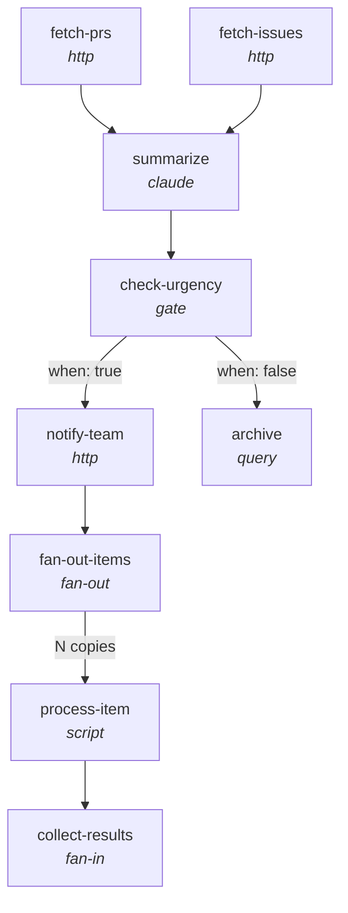

# Workflows and DAGs

liteflow models every workflow as a **directed acyclic graph (DAG)** stored in SQLite. This page explains why DAGs are the right abstraction, how liteflow represents them in the database, and how the pieces fit together at execution time.

---

## What is a DAG?

A directed acyclic graph is a set of **nodes** connected by **edges** that flow in one direction and never form a cycle. Three properties make DAGs a natural fit for workflows:

- **Dependency ordering.** Edges encode "this must happen before that," so the engine can determine a safe execution order automatically.
- **No cycles.** Because the graph is acyclic, execution is guaranteed to terminate -- there is no risk of an infinite loop in the workflow structure itself.
- **Parallelism.** Independent branches of the graph can run concurrently. If two steps share no dependency relationship, the engine is free to execute them at the same time.

In liteflow, the nodes of a DAG are **steps** (units of work) and the edges are **transitions** (execution flow with optional conditions). A **workflow** is the top-level container that owns a set of steps and transitions.

---

## Workflow Structure

liteflow persists workflows using [`simple-graph-sqlite`](https://github.com/dpapathanasiou/simple-graph-sqlite), a lightweight library that stores nodes and edges as JSON blobs in SQLite. Three data types live in the graph database:

### Workflow Node

The workflow node is the top-level container. It owns steps via "contains" edges.

```json
{
  "id": "workflow_id",
  "type": "workflow",
  "name": "Human Name",
  "description": "Optional description",
  "metadata": {}
}
```

### Step Node

Each step is a node linked to its parent workflow. The `type` field selects the executor, and the remaining fields are type-specific configuration.

```json
{
  "id": "step_id",
  "type": "step",
  "node_type": "step",
  "workflow_id": "parent_workflow",
  "...": "step-type-specific config (script, command, prompt, etc.)"
}
```

### Edges

Two kinds of edges connect nodes in the graph:

| Edge type | From | To | Purpose |
|-----------|------|----|---------|
| `contains` | Workflow | Step | Declares ownership -- the step belongs to this workflow |
| `transition` | Step | Step | Declares execution flow, with optional conditions |

A "contains" edge carries `{"type": "contains"}`. A "transition" edge carries `{"type": "transition", "conditions": {...}}`, where conditions may be empty for unconditional transitions.

---

## Step Types Overview

Every step has a `type` field that selects its executor in `steps.py`. liteflow ships nine step types:

| Type | Purpose | When to use |
|------|---------|-------------|
| `script` | Run a Python file that follows the step contract | Custom logic, data processing, API integrations |
| `shell` | Run a shell command or `.sh` script file | System commands, CLI tools, file operations |
| `claude` | LLM reasoning with a templated prompt | Judgment, classification, summarization, text generation |
| `query` | SQL against any SQLite database | Reading/writing structured data |
| `http` | HTTP request via `urllib` (zero external deps) | REST API calls, webhooks |
| `transform` | Pure data transformation (Python `eval`) | Reshaping data between steps |
| `gate` | Conditional branch point (Python `eval`) | If/else routing in a DAG |
| `fan-out` | Split an array into parallel executions | Process each item independently |
| `fan-in` | Collect parallel results | Aggregate fan-out outputs |

For full configuration details on each type, see the [step types reference](../reference/step-types/index.md).

---

## Edge Conditions

Transition edges can carry conditions that control whether execution follows that edge. There are three styles:

### Unconditional

An edge with no `conditions` (or an empty conditions object) is always followed when its source step completes.

```json
{"type": "transition", "conditions": {}}
```

### Gate-Based

Used after a `gate` step that returns `{"_gate_result": true}` or `{"_gate_result": false}`. The `when` field determines which branch to follow:

| `when` value | Follows when |
|---|---|
| `"true"` | Gate returned `true` |
| `"false"` | Gate returned `false` |
| `"always"` | Always, regardless of gate result |

```json
{"type": "transition", "conditions": {"when": "true"}}
```

```json
{"type": "transition", "conditions": {"when": "false"}}
```

### Expression-Based

A Python expression evaluated against the current execution context. The expression has access to the full context dict plus a set of safe builtins: `len`, `str`, `int`, `float`, `bool`, `any`, `all`, `True`, `False`, and `None`.

```json
{
  "type": "transition",
  "conditions": {
    "expression": "len(context['fetch_data']['rows']) > 0"
  }
}
```

The expression must evaluate to a truthy value for the edge to be followed. If evaluation raises an exception, the edge is **not** followed.

For more on gate-based branching and conditional routing, see [gate and fan-out/fan-in details](../reference/step-types/gate-fanout-fanin.md).

---

## Entry Steps

Steps with no inbound transition edges are **entry steps** -- they are the starting points of a workflow. The engine identifies them with `get_entry_steps()`, which collects all steps belonging to the workflow and filters out any that appear as a target in a transition edge.

A workflow can have **multiple entry steps**. When it does, all entry steps are enqueued at the start of execution and run in parallel. This is useful when a workflow needs to gather data from independent sources before merging results downstream.

---

## Fan-Out/Fan-In Pattern

The fan-out/fan-in pattern lets a workflow process a collection of items in parallel and then aggregate the results.

### How it works

1. A **fan-out** step reads an array from context (via the `over` config field) and produces `_fan_out_items` -- a list of per-item context dicts.
2. The engine enqueues **N copies** of the successor step, one for each item. Each copy receives per-item context plus tracking metadata:
   - `_fan_out_step` -- the step ID that produced the fan-out
   - `_fan_out_total` -- total number of items
   - `_fan_out_index` -- this item's zero-based index
3. As each copy completes, the engine checks whether **all** copies are done.
4. When the last copy finishes, the engine collects all outputs into `_fan_in_results` and enqueues the successor steps with the merged context.
5. The **fan-in** step receives the collected results and can aggregate, filter, or summarize them.

### Example workflow

The following diagram shows a workflow that combines several patterns: parallel entry steps converging on a single step, gate-based branching, and fan-out/fan-in processing.



In this workflow:

- **fetch-prs** and **fetch-issues** are parallel entry steps. The engine enqueues both at the start.
- **summarize** has two predecessors, so the engine waits for both to complete before running it.
- **check-urgency** is a gate that evaluates a condition and returns `_gate_result`.
- The `when: true` edge leads to **notify-team**; the `when: false` edge leads to **archive**.
- **fan-out-items** splits an array into N items, each processed independently by **process-item**.
- **collect-results** runs once all N copies complete, receiving `_fan_in_results`.

---

## Workflow Lifecycle

A workflow moves through five stages:

### 1. Create

Define a new workflow with steps and transitions.

- Use `/liteflow:flow-new` for guided creation with templates.
- Use `/liteflow:flow-build` for AI-assisted workflow construction from a natural-language description.

### 2. Edit

Modify an existing workflow -- add, remove, or reconfigure steps and transitions.

- Use `/liteflow:flow-edit` to modify a workflow interactively.

### 3. Run

Execute the workflow. The engine finds entry steps, enqueues them, and runs the execution loop until all steps complete or an error occurs.

- Use `/liteflow:flow-run` to execute a workflow.
- Pass `--dry-run` to see what would execute without actually running steps.
- Pass `--context '{...}'` to provide initial context data.

### 4. Inspect

Examine execution results -- see which steps ran, their outputs, timing, and any errors.

- Use `/liteflow:flow-inspect` to view detailed results of a specific run.

### 5. Optimize

Improve workflow performance, reliability, and structure.

- Use the **workflow-optimizer** agent to analyze a workflow and suggest improvements such as adding parallelism, tuning error policies, or restructuring steps.

---

## See Also

- [System Architecture](architecture.md) -- how the plugin layer and Python runtime fit together
- [Execution Engine](execution-engine.md) -- the run loop, queue processing, and error handling in detail
- [Context and Data Flow](context-and-data-flow.md) -- how data passes between steps via context accumulation
- [Step Types Reference](../reference/step-types/index.md) -- full configuration reference for all nine step types
- [Gate and Fan-Out/Fan-In](../reference/step-types/gate-fanout-fanin.md) -- detailed guide to conditional branching and parallel processing
- [Documentation Home](../index.md)
