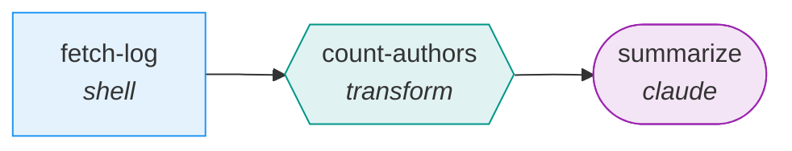

# Building Your First Workflow

This guide walks through creating, running, and inspecting a complete workflow from scratch. By the end, you will have a working 3-step workflow that fetches data, transforms it, and generates a summary with Claude.

**Prerequisites**: liteflow must be installed and set up. If you have not done that yet, see [Installation](installation.md) and run `/liteflow:flow-setup`.

---

## What We'll Build

A "repo-summary" workflow with three steps:

1. **fetch-log** (shell step) -- runs `git log` to get recent commit history
2. **count-authors** (transform step) -- extracts commit counts per author from the log output
3. **summarize** (claude step) -- generates a human-readable summary of the repository activity

The workflow forms a simple linear DAG:



Each step's output feeds into the next through liteflow's context accumulation model. The shell step produces raw git log data, the transform step reshapes it, and the claude step reasons over the result.

---

## Method 1: Conversational Builder

The conversational builder guides you through workflow creation interactively, asking questions and confirming each step before proceeding.

```
/liteflow:flow-build
```

Claude will walk you through the process one question at a time:

**Step 1 -- Define the goal.** Claude asks what the workflow should accomplish. You describe the repo-summary concept:

> "I want a workflow that gets the recent git log for a repository, counts commits by author, and summarizes the activity."

**Step 2 -- Identify dependencies.** Claude asks about external services and APIs. For this workflow, there are none -- it only needs local git access and Claude itself.

**Step 3 -- Determine graph shape.** Claude asks about conditional branches or parallel processing. This is a simple linear pipeline, so no branching is needed.

**Step 4 -- Propose steps.** Based on your answers, Claude proposes a set of steps with names, types, and purposes. You can adjust names, reorder steps, change types, or add/remove steps before confirming.

**Step 5 -- Generate scripts.** For each confirmed step, Claude generates a script following the [step contract](../reference/step-types/index.md) and saves it to `~/.liteflow/steps/repo-summary/`.

**Step 6 -- Register the graph.** Claude creates the workflow in the graph database, registers all steps and edges, and wires up the DAG.

**Step 7 -- Visualize and confirm.** Claude displays the complete workflow structure with a Mermaid diagram and suggests next steps:

- Do a dry run: `/liteflow:flow-run repo-summary --dry-run`
- Set up credentials if needed: `/liteflow:flow-auth`
- Schedule it: `/liteflow:flow-schedule`

---

## Method 2: One-Shot Creation

If you already know what you want, skip the conversation and create the workflow in a single command:

```
/liteflow:flow-new repo-summary "Get recent git log, count commits by author, and summarize the activity"
```

This does everything at once:

1. **Parses the description** to identify individual steps and their types
2. **Designs the DAG** -- determines the step sequence and data flow
3. **Generates step scripts** at `~/.liteflow/steps/repo-summary/`, each following the step contract (reads JSON from stdin, has a `run(context)` function, outputs JSON to stdout)
4. **Registers the workflow** in the graph database with all steps and edges
5. **Displays the result** -- shows each step with its type, the edges connecting them, and a Mermaid diagram

If you provide only a name without a description, Claude will ask what the workflow should do before proceeding:

```
/liteflow:flow-new repo-summary
```

---

## Understanding What Was Created

After creation, you have two things: a workflow graph registered in the database and step scripts on disk.

### Examining the workflow structure

```
/liteflow:flow-show repo-summary
```

This displays three sections:

- **Step details** -- each step's ID, type (shell, transform, claude), and a configuration summary describing what the step does
- **Edge connections** -- the flow between steps (e.g., `fetch-log -> count-authors -> summarize`), with any condition labels on edges
- **Mermaid diagram** -- a visual flowchart of the DAG with node shapes and colors by step type

### Files on disk

Step scripts live under `~/.liteflow/steps/` in a directory named after the workflow:

```
~/.liteflow/steps/repo-summary/
├── fetch_log.sh          # Shell step -- runs git log
├── count_authors.py      # Script step -- parses log output
└── ...                   # Additional files depend on what was generated
```

The exact files depend on the step types chosen during creation. Shell steps produce `.sh` files, script steps produce `.py` files, and some step types (transform, gate, claude) are configured inline in the graph database rather than as separate script files.

### Generating a standalone visualization

```
/liteflow:flow-visualize repo-summary
```

This generates a Mermaid flowchart with distinct node shapes and color coding by step type:

| Step Type | Shape | Color |
|-----------|-------|-------|
| shell / script | Rectangle | Blue |
| claude | Stadium | Purple |
| transform | Hexagon | Teal |
| gate | Diamond | Yellow |
| http | Parallelogram | Orange |
| query | Subroutine | Green |
| fan-out / fan-in | Double circle | Pink |

Edges are labeled with condition text where applicable. The output is a complete Mermaid code block you can render in any Mermaid-compatible viewer.

---

## Running the Workflow

```
/liteflow:flow-run repo-summary
```

### What happens during execution

1. **Find entry steps.** The engine identifies steps with no inbound edges -- these are the starting points. In our case, `fetch-log` is the only entry step.
2. **Enqueue entry steps.** Entry steps are placed in the execution queue with the initial context.
3. **Dequeue-execute-enqueue loop.** The engine pops steps from the queue one at a time, loads each step's config from the graph database, builds context from prior step outputs, and dispatches to the appropriate executor.
4. **Stream progress.** Each step's status is displayed as it runs: running, completed, failed, or skipped.
5. **Display results.** When the queue is empty, the run is complete. The engine shows total execution time, number of steps completed, and the final output data.

### Passing initial context

Supply runtime parameters as a JSON object with the `--context` flag:

```
/liteflow:flow-run repo-summary --context '{"repo_path": "/path/to/repo", "num_commits": 50}'
```

Steps can reference these values via template substitution (e.g., `{repo_path}` in a shell command) or direct context access in transform/gate expressions. See [Context and Data Flow](../concepts/context-and-data-flow.md) for details.

### Dry-run mode

Validate the workflow without executing any steps:

```
/liteflow:flow-run repo-summary --dry-run
```

Dry run traverses the entire reachable graph, logging what would execute at each step and verifying that:

- The DAG structure is correct
- Template variables resolve to expected context keys
- Entry steps and edge connections are wired correctly

No side effects occur. All successors are enqueued unconditionally (edge conditions are not evaluated), so you see the full execution path.

---

## Inspecting Results

After a run completes (or fails), inspect the detailed execution record.

### Most recent run

```
/liteflow:flow-inspect last
```

### A specific run

```
/liteflow:flow-inspect <run-id>
```

The run ID is the 12-character hex string displayed when the workflow starts (e.g., `a1b2c3d4e5f6`).

### What you see

The inspection output has four sections:

1. **Run metadata** -- workflow name, run ID, overall status (completed or failed), start time, end time, and total duration.

2. **Step-by-step execution timeline** -- each step in execution order with:
   - Step name and type
   - Status (completed, failed, skipped)
   - Duration
   - Input context (summarized if large)
   - Output data (summarized if large)

3. **Failure analysis** (if any step failed) -- the full error message, an analysis of what likely went wrong, and suggestions for fixing the issue (missing credentials, invalid input data, script errors, etc.).

4. **Recommendations** -- suggested next actions based on the results:
   - Re-run with fixes
   - Edit the workflow: `/liteflow:flow-edit repo-summary`
   - Check credentials: `/liteflow:flow-auth test`

---

## Viewing History

See all past runs for a workflow:

```
/liteflow:flow-history repo-summary
```

This displays a table with:

| Column | Description |
|--------|-------------|
| **Run ID** | Unique identifier for the execution |
| **Workflow** | Workflow name |
| **Status** | success, failed, or running |
| **Started** | Start timestamp |
| **Duration** | How long the run took |
| **Steps Completed** | Number of steps completed successfully out of total |

To see history across all workflows or limit the number of results:

```
/liteflow:flow-history --limit 10
```

---

## Modifying the Workflow

After running a workflow, you may want to adjust it -- add steps, change connections, or edit existing step logic.

### Add a step

```
/liteflow:flow-edit repo-summary add-step "Send the summary to Slack"
```

Claude determines the step type (e.g., http), generates a script, saves it to `~/.liteflow/steps/repo-summary/`, registers the step in the graph, and asks where to connect it in the DAG.

### Connect steps

```
/liteflow:flow-edit repo-summary connect summarize send-slack
```

Creates an edge between two existing steps. Add a condition with the `--condition` flag:

```
/liteflow:flow-edit repo-summary connect summarize send-slack --condition '{"when": "true"}'
```

### Edit an existing step

```
/liteflow:flow-edit repo-summary edit-step count-authors
```

Claude reads the current step configuration and script, asks what you want to change, updates the code, and saves the changes.

### Remove a step

```
/liteflow:flow-edit repo-summary remove-step send-slack
```

Removes the step from the graph, reconnects surrounding edges to maintain continuity, and deletes its script file.

After any edit, the updated workflow structure is displayed so you can verify the changes.

---

## Next Steps

Now that you have a working workflow, explore these topics to do more:

- **Add API credentials** for external services (GitHub, Slack, etc.) -- see [Credential Management](credentials.md)
- **Schedule the workflow** to run automatically on a timer or in response to events -- see [Scheduling](scheduling.md)
- **Start from a template** instead of building from scratch -- see [Templates](templates.md)
- **Understand context accumulation** and how data flows between steps -- see [Context and Data Flow](../concepts/context-and-data-flow.md)
- **Learn about all 9 step types** and when to use each one -- see [Step Types Reference](../reference/step-types/index.md)
- **Debug workflow failures** with the inspection tools and debugger agent -- see [Command Reference](../reference/commands.md)

---

## See Also

- [Installation](installation.md) -- first-time setup
- [Credential Management](credentials.md) -- storing and testing service tokens
- [Scheduling](scheduling.md) -- recurring and event-driven execution
- [Templates](templates.md) -- pre-built workflow starting points
- [Workflows and DAGs](../concepts/workflows-and-dags.md) -- the DAG model and step types
- [Context and Data Flow](../concepts/context-and-data-flow.md) -- how data passes between steps
- [Command Reference](../reference/commands.md) -- all 16 commands, 3 agents, 2 skills, and 1 hook
- [Step Types Reference](../reference/step-types/index.md) -- configuration for all 9 step types
- [Documentation Home](../index.md)
