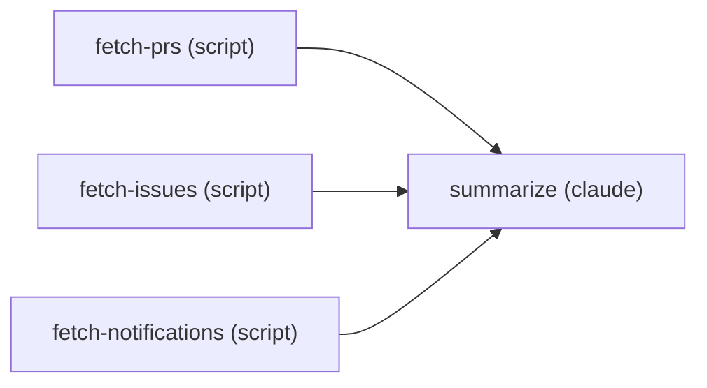
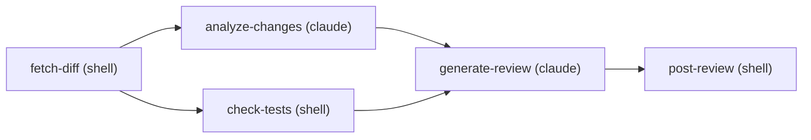
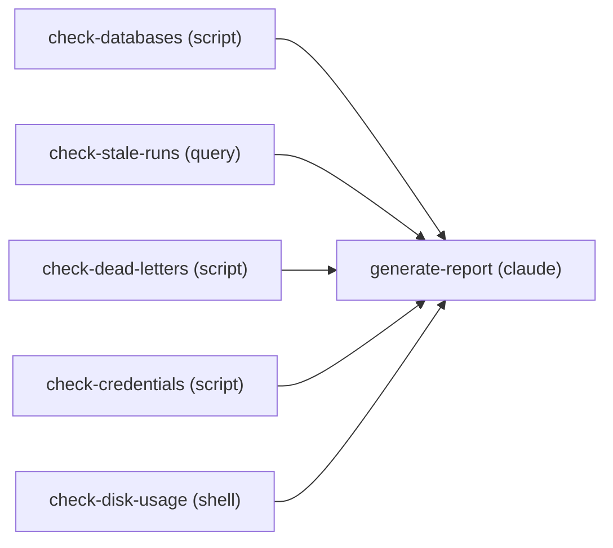

# Using Workflow Templates

Templates are pre-built workflow definitions bundled with liteflow. Each template includes a complete DAG definition, step scripts, and metadata -- ready to be instantiated into a working workflow with a single command.

---

## What Are Templates?

A template is a self-contained directory under `templates/` in the plugin root. Every template ships three components:

| Component | File | Purpose |
|-----------|------|---------|
| Metadata | `manifest.json` | Name, description, version, required credentials, configurable variables |
| DAG definition | `workflow.json` | Nodes (steps) and edges (transitions) that define the workflow graph |
| Implementation | `steps/` | Python and shell scripts that implement each step |

When you create a workflow from a template, liteflow copies the step scripts to `~/.liteflow/steps/<workflow-name>/`, substitutes any configuration variables, and registers the DAG in the workflow database.

---

## Listing Templates

To see all available templates:

```
/liteflow:flow-templates
```

This reads each template's `manifest.json` and displays:

- **Name** -- template identifier
- **Description** -- what the workflow does
- **Required Credentials** -- services that need authentication configured

---

## Morning Briefing Template

**Purpose:** Daily briefing of GitHub activity -- pending PRs, open issues, and notifications.

| | |
|---|---|
| **Required credentials** | `github` |
| **Variables** | `github_username` -- Your GitHub username |
| | `repos` -- Comma-separated list of repos to monitor (`owner/repo`) |

### DAG Structure

Three parallel entry steps converge on a single claude step that compiles the briefing:



### Steps

| Step | Type | Description |
|------|------|-------------|
| `fetch-prs` | script | Uses the GitHub API to search for PRs requesting review from the user |
| `fetch-issues` | script | Fetches open issues assigned to the user |
| `fetch-notifications` | script | Fetches recent GitHub notifications |
| `summarize` | claude | Compiles all findings into a formatted daily briefing |

The three fetch steps run in parallel (they have no inbound edges, making them all entry steps). The engine waits for all three to complete before running `summarize`, which receives the combined output from all upstream steps in its context.

### Creating It

```
/liteflow:flow-templates morning-briefing
```

You will be prompted for:

1. `github_username` -- Your GitHub username
2. `repos` -- Comma-separated list of repositories to monitor (e.g., `octocat/hello-world,octocat/spoon-knife`)

Before running, set up GitHub credentials with `/liteflow:flow-auth github`.

---

## PR Review Template

**Purpose:** Automated PR review -- fetch the diff, analyze changes, check CI status, generate a structured review, and post it.

| | |
|---|---|
| **Required credentials** | `github` |
| **Variables** | `pr_url` -- Pull request URL or `owner/repo#number` format |

### DAG Structure

A linear fetch fans out into parallel analysis, then converges for review generation and posting:



### Steps

| Step | Type | Description |
|------|------|-------------|
| `fetch-diff` | shell | Uses `gh pr diff` to fetch the PR diff |
| `analyze-changes` | claude | Analyzes the diff for issues, patterns, and suggestions |
| `check-tests` | shell | Checks PR CI status and test results |
| `generate-review` | claude | Combines analysis and test results into a structured review |
| `post-review` | shell | Posts the review comment to the PR |

`fetch-diff` is the sole entry step. After it completes, `analyze-changes` and `check-tests` run in parallel. Both must finish before `generate-review` runs (the engine waits for all predecessors). Finally, `post-review` posts the result.

### Creating It

```
/liteflow:flow-templates pr-review
```

You will be prompted for:

1. `pr_url` -- The pull request to review (e.g., `https://github.com/owner/repo/pull/42` or `owner/repo#42`)

Before running, set up GitHub credentials with `/liteflow:flow-auth github`.

---

## Health Check Template

**Purpose:** Self-diagnostic for your liteflow installation -- database integrity, stale runs, queue health, credential validation, and disk usage.

| | |
|---|---|
| **Required credentials** | none |
| **Variables** | none |

### DAG Structure

Five parallel diagnostic steps converge on a single report step:



### Steps

| Step | Type | Description |
|------|------|-------------|
| `check-databases` | script | Runs `PRAGMA integrity_check` on all liteflow `.db` files |
| `check-stale-runs` | query | SQL query to find workflow runs stuck in running status for over 1 hour |
| `check-dead-letters` | script | Checks `queue.db` for dead letter (failed) messages |
| `check-credentials` | script | Tests all stored credentials for validity |
| `check-disk-usage` | shell | Reports disk usage for all liteflow data under `~/.liteflow/` |
| `generate-report` | claude | Compiles all findings into a structured health report |

All five check steps are entry steps and run in parallel. The engine waits for all to complete before `generate-report` runs with the full diagnostic context.

### Creating It

```
/liteflow:flow-templates liteflow-health
```

No variables or credentials are required. This template works out of the box.

---

## Creating a Workflow from a Template

The general process for any template:

```
/liteflow:flow-templates <template-name>
```

This triggers the following sequence:

1. **Read metadata** -- Loads `manifest.json` for the template's name, description, required credentials, and configurable variables.
2. **Gather configuration** -- Prompts for variable values. If credentials are required, suggests using `/liteflow:flow-auth` to configure them.
3. **Copy step scripts** -- Copies the template's `steps/` directory to `~/.liteflow/steps/<workflow-name>/`, substituting any configuration placeholders in the scripts.
4. **Register the workflow** -- Registers the DAG from `workflow.json` in the workflow database, creating all nodes (steps) and edges (transitions).
5. **Confirm** -- Shows the created workflow structure and suggests next steps:
   - Test with a dry run: `/liteflow:flow-run <workflow-name> --dry-run`
   - Schedule recurring execution: `/liteflow:flow-schedule`

---

## Template File Structure

For developers creating their own templates, the directory layout is:

```
templates/<name>/
├── manifest.json     # Metadata, credentials, variables
├── workflow.json     # DAG definition (nodes and edges)
└── steps/            # Implementation files
    ├── step1.py
    ├── step2.sh
    └── ...
```

### manifest.json

```json
{
  "name": "template-name",
  "description": "What this workflow does",
  "version": "1.0.0",
  "required_credentials": ["github"],
  "variables": {
    "var_name": "Description shown to the user when prompted"
  }
}
```

- `required_credentials` -- Array of credential names the workflow needs. Use an empty array (`[]`) if none are required.
- `variables` -- Object mapping variable names to user-facing descriptions. Use an empty object (`{}`) if no configuration is needed.

### workflow.json

```json
{
  "nodes": [
    {
      "id": "step-id",
      "type": "script",
      "script": "steps/step_file.py",
      "description": "What this step does"
    }
  ],
  "edges": [
    { "from": "step-a", "to": "step-b" }
  ]
}
```

- `nodes` -- Each node has an `id`, a step `type` (script, shell, claude, query, http, transform, gate, fan-out, fan-in), a `script` path relative to the template directory, and a `description`.
- `edges` -- Each edge defines a transition from one step to another. Steps with no inbound edges are entry steps and run first.

For the full template authoring guide, see [Creating Templates](../guides/creating-templates.md).

---

## See Also

- [Installation](installation.md) -- Set up liteflow before using templates
- [Your First Workflow](first-workflow.md) -- Building custom workflows from scratch
- [Credentials](credentials.md) -- Setting up credentials required by templates
- [Scheduling](scheduling.md) -- Scheduling template workflows for recurring execution
- [Commands Reference](../reference/commands.md) -- Full reference for all commands including `flow-templates`
- [Creating Templates](../guides/creating-templates.md) -- Guide to authoring your own templates
- [Documentation Home](../index.md) -- Back to the docs home page
