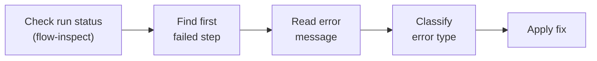

# Debugging Failed Workflows

A practical guide for diagnosing and fixing workflow failures. Covers the triage process, a catalog of common error patterns, direct database queries for advanced investigation, and preventive practices.

---

## Quick Triage

When a workflow fails, follow this path from discovery to fix:



Most failures resolve within a single pass through this flowchart. The sections below expand each box into concrete actions.

---

## Step-by-Step Debugging Process

### Step 1: Inspect the run

Start by pulling the full run record. `flow-inspect` shows run metadata, the step timeline, and input/output for each step.

```
/liteflow:flow-inspect last
# or
/liteflow:flow-inspect <run-id>
```

If you do not know the run ID, use `flow-history` to list recent executions:

```
/liteflow:flow-history <workflow-name> --limit 5
```

### Step 2: Find the failure point

Scan the step timeline for the first step with `status: "failed"`. Note three things:

1. **The step ID and type** -- tells you which executor ran (script, shell, claude, http, etc.).
2. **The error message** -- the raw exception or HTTP status that caused the failure.
3. **The input context** -- the data the step received. A mismatch between expected and actual context is the most common root cause.

Steps after the failed step will typically show `status: "skipped"` or never appear at all, because the engine stops enqueuing successors when a step fails (unless `on_error` is set to `skip`).

### Step 3: Classify the error

Errors fall into a small number of categories. See the [Error Catalog](#error-catalog) below for symptoms, root causes, diagnostics, and fixes for each pattern.

### Step 4: Test the step independently

Isolate the failing step by feeding it the exact input context from `flow-inspect`:

```bash
# Extract the input context JSON from flow-inspect output, then pipe it to the step script
echo '<json from flow-inspect>' | python3 ~/.liteflow/steps/<workflow-name>/<step>.py
```

For shell steps, run the command directly. For claude steps, run the templated prompt through `claude -p` manually. The goal is to reproduce the failure outside the engine so you can iterate quickly.

### Step 5: Apply the fix

The fix depends on the error type. Each entry in the catalog below includes a concrete fix. After applying it, re-run the workflow with `--dry-run` first to validate the graph structure, then run it for real.

---

## Error Catalog

Twelve error patterns that account for the vast majority of workflow failures.

### 1. Authentication Failures

| | |
|---|---|
| **Symptom** | HTTP 401/403, "Unauthorized", "Bad credentials" |
| **Root cause** | Token expired, invalid, revoked, or missing required scopes |
| **Diagnostic** | `/liteflow:flow-auth test <service>` -- reports whether the stored credential is still valid |
| **Fix** | If the test fails, remove and re-add the credential: `/liteflow:flow-auth remove <service>` then `/liteflow:flow-auth <service>`. Verify the token has the scopes your workflow needs (e.g., `repo` for GitHub, `chat:write` for Slack). |

### 2. Data Shape Mismatches

| | |
|---|---|
| **Symptom** | `TypeError`, `KeyError`, or unexpected `None` in a step script |
| **Root cause** | A prior step's output does not match the structure the current step expects. Common after changing an upstream step without updating downstream consumers. |
| **Diagnostic** | Use `flow-inspect` to compare the actual output of the producing step against what the consuming step reads from context. |
| **Fix** | Either fix the upstream step to produce the expected shape, or insert a transform step between them to validate and reshape the data. |

### 3. Missing Context Keys

| | |
|---|---|
| **Symptom** | `KeyError`, `NoneType` errors, or unresolved `{variable}` literals in output |
| **Root cause** | The step references a context key that no prior step produced. Often caused by a typo in `step_id` or a step that was skipped due to a failed predecessor. |
| **Diagnostic** | In `flow-inspect` output, check that the producing step ran successfully and that its output contains the expected key. Verify the `step_id` matches exactly (including hyphens). |
| **Fix** | Correct the step ID or key path. For defensive access, use `context.get("key", default)` in step scripts instead of direct indexing. If using `StepContext`, call `require()` to get a clear error when required keys are absent. |

### 4. Template Substitution Failures

| | |
|---|---|
| **Symptom** | Literal `{variable}` strings appearing in commands, prompts, or URLs instead of resolved values |
| **Root cause** | The key path in the template does not match the actual context structure. Dot-paths like `{step-name.nested.key}` must exactly mirror the context dict hierarchy. |
| **Diagnostic** | Use `flow-inspect` to view the context at the point the step executed. Compare the dot-path in the template against the actual keys. |
| **Fix** | Correct the dot-path to match the real context structure. Remember that step IDs with hyphens are valid in templates: `{my-step.output.value}` works. |

### 5. HTTP Errors

| | |
|---|---|
| **Symptom** | `HTTPError` with status 429 (rate limit), 5xx (server error), or connection timeout |
| **Root cause** | External API is rate-limiting, experiencing an outage, or the request is malformed |
| **Diagnostic** | Check the HTTP status code and response body in the error message. For 429, check rate limit headers. For 5xx, check the API's status page. |
| **Fix** | Add `on_error: "retry"` with an appropriate `max_retries` value (e.g., 3) to the step config. Add a `timeout` if not set. For persistent rate limits, add a transform step before the HTTP step to batch or throttle requests. |

### 6. Queue Stuck

| | |
|---|---|
| **Symptom** | Run stays in `"running"` status indefinitely, no new steps execute |
| **Root cause** | Unacknowledged messages in the queue, an empty fan-out that produced zero items, or a predecessor gate whose condition is never satisfied |
| **Diagnostic** | Query `queue.db` for active messages (see [Direct Database Queries](#direct-database-queries)). Check whether the fan-out step produced an empty `_fan_out_items` list. Inspect gate conditions. |
| **Fix** | For stuck queues, manually acknowledge stale messages. For empty fan-outs, add a gate step before the fan-out to verify the source list is non-empty. For unsatisfied gates, fix the gate condition or ensure the prerequisite steps produce the expected values. |

### 7. Timeout Errors

| | |
|---|---|
| **Symptom** | `subprocess.TimeoutExpired` |
| **Root cause** | The step takes longer than its configured timeout |
| **Diagnostic** | Check `started_at` and `completed_at` timestamps in `flow-inspect` to see actual duration. Compare against the timeout in the step config. |
| **Fix** | Increase the timeout in the step configuration. Default timeouts by step type: script (300s), shell (120s), claude (120s). Set an explicit `timeout` value in the step config for slow operations. |

### 8. Script Import Errors

| | |
|---|---|
| **Symptom** | `ModuleNotFoundError` for a Python package |
| **Root cause** | The step script imports a package that is not installed in the current Python environment |
| **Diagnostic** | Read the error to identify the missing module name. Check whether it is listed in any requirements file or installed globally. |
| **Fix** | Add the dependency to the step script using `deps.ensure_deps()` for automatic lazy installation, or install it manually with `pip install <package>`. For optional SDK dependencies (PyGithub, slack_sdk, etc.), liteflow's lazy-dep system will install them on first use if `deps.py` knows about them. |

### 9. Permission Errors

| | |
|---|---|
| **Symptom** | `PermissionError` when reading/writing files or databases |
| **Root cause** | File permissions on step scripts, database files, or the `~/.liteflow/` directory |
| **Diagnostic** | Check the path in the error message. Run `ls -la` on the file and its parent directory. |
| **Fix** | Fix permissions: `chmod 644` for database files, `chmod 755` for step script files, `chmod 755` for the `~/.liteflow/` and `~/.liteflow/steps/` directories. |

### 10. Database Lock Errors

| | |
|---|---|
| **Symptom** | `sqlite3.OperationalError: database is locked` |
| **Root cause** | Concurrent access to a SQLite database file, typically from two workflow runs executing simultaneously |
| **Diagnostic** | Check for other running processes accessing `~/.liteflow/*.db` files. Use `lsof ~/.liteflow/execution.db` to see which processes hold the file. |
| **Fix** | Ensure only one workflow run is active at a time. If a previous run crashed without releasing the lock, the lock will clear when that process exits. In rare cases, restarting the terminal session clears stale locks. |

### 11. Fan-Out/Fan-In Errors

| | |
|---|---|
| **Symptom** | "Fan-out path not found", non-list value at the dot-path, or partial/missing `_fan_in_results` |
| **Root cause** | The dot-path in the fan-out config points to a missing or non-array value, or some fan-out items failed and their results were not collected |
| **Diagnostic** | Use `flow-inspect` to check the fan-out step's input context. Verify the dot-path resolves to a list. Check individual fan-out item step runs for failures. |
| **Fix** | Correct the dot-path to point at an actual array in the context. Add a gate step before the fan-out to validate that the data exists and is a list. For non-critical items, set `on_error: "skip"` so partial failures do not block the fan-in step. |

### 12. Gate Condition Errors

| | |
|---|---|
| **Symptom** | `SyntaxError` or `NameError` during gate evaluation |
| **Root cause** | The gate condition contains invalid Python syntax or references a variable not available in the evaluation scope |
| **Diagnostic** | Read the gate condition from the step config. Test it manually in a Python REPL with a mock `context` dict. |
| **Fix** | Fix the Python expression syntax. Use `context.get("key", default)` instead of direct key access to avoid `KeyError` inside the expression. The evaluation scope provides `context` as a local variable plus safe builtins and the `json` module. |

---

## Direct Database Queries

For advanced debugging, query the SQLite databases directly. All databases live at `~/.liteflow/`.

**Find failed steps for a run:**

```sql
SELECT step_id, status, error, started_at, completed_at
FROM step_runs
WHERE run_id = '<run-id>' AND status = 'failed';
```

**Check the queue for stuck messages:**

```sql
SELECT * FROM queue WHERE status = 'active';
```

**Find stale runs (running for more than an hour):**

```sql
SELECT id, workflow_id, started_at
FROM runs
WHERE status = 'running'
  AND started_at < datetime('now', '-1 hour');
```

**Get step output for a completed run (parse values as JSON):**

```sql
SELECT step_id, output
FROM step_runs
WHERE run_id = '<run-id>' AND status = 'completed';
```

Run any of these with:

```bash
sqlite3 ~/.liteflow/execution.db "<query>"
```

For queue queries, use `~/.liteflow/queue.db` instead.

---

## Prevention Checklist

Practices that catch failures before they reach production runs:

- **Always `--dry-run` first** to validate graph structure and template resolution before a real execution.
- **Test credentials early** with `/liteflow:flow-auth test <service>` before running workflows that call external APIs.
- **Validate data shape between critical steps** by inserting transform steps that assert expected keys and types.
- **Set appropriate timeouts** for steps that call slow APIs or process large datasets. Do not rely on defaults for production workflows.
- **Test step scripts independently** by piping sample JSON to them before integrating into a workflow.
- **Use `on_error: "retry"`** for steps that call external APIs, with a reasonable `max_retries` value (2--3 is typical).
- **Guard fan-out inputs with a gate** to prevent empty-array fan-outs that produce zero items and stall the run.

---

## Using the Workflow Debugger Agent

The `workflow-debugger` agent automates much of the process described above. Trigger it by describing a failure in natural language:

> "My morning-briefing workflow failed"

The agent will:

1. Inspect the most recent run of the named workflow.
2. Find the first failed step and read its error.
3. Classify the error against the catalog above.
4. Propose a specific fix.

Its output follows a structured format:

| Field | Content |
|-------|---------|
| **Symptom** | What the user sees (error message, stuck run, wrong output) |
| **Root Cause** | Why it happened (expired token, missing key, bad dot-path) |
| **Fix** | Concrete action to resolve it |
| **Prevention** | How to avoid recurrence |

For most failures, the agent resolves the issue without manual database queries.

---

## See Also

- [Command Reference](../reference/commands.md) -- `flow-inspect` and `flow-auth test` usage
- [Module Reference](../reference/modules/index.md) -- `state.py` (step_runs table), `queue.py` (queue internals)
- [The Execution Engine](../concepts/execution-engine.md) -- error policies (`on_error`), the run loop, step dispatch
- [Context and Data Flow](../concepts/context-and-data-flow.md) -- template substitution, dot-paths, context accumulation
- [Credentials](../getting-started/credentials.md) -- credential management and `flow-auth`
- [Documentation Home](../index.md)
