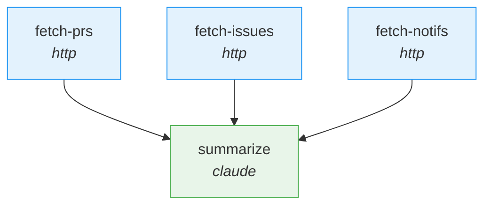
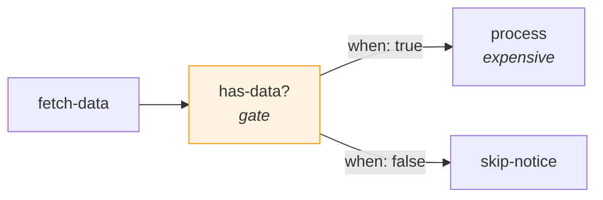

# Optimizing Workflow Performance

This guide covers how to analyze workflow execution, identify bottlenecks, and apply targeted optimizations to improve speed, reliability, and efficiency.

---

## Gathering Metrics

Start by looking at recent execution history for the workflow you want to optimize:

```
/liteflow:flow-history my-workflow --limit 20
```

Then inspect individual runs to get per-step detail:

```
/liteflow:flow-inspect <run-id>
```

Look for patterns in:

- **Total run duration** -- is it increasing over time, or consistently slow?
- **Per-step durations** -- which steps consume the most time? Use `flow-inspect` output to compare step timings across runs.
- **Failure rates** -- are certain steps failing repeatedly? Frequent retries add latency even when they eventually succeed.
- **Which steps are slowest** -- rank steps by duration to find the biggest optimization targets.

---

## Identifying Bottlenecks

Most workflow performance problems fall into four categories:

### API-bound

HTTP steps waiting on external services. Symptoms: step durations that vary widely between runs, occasional timeouts, or steps that are fast in isolation but slow under load.

Look for: timeout errors in step output, HTTP 429 (rate limit) responses, or consistently high durations on `http` steps.

### Compute-bound

Script or shell steps doing heavy local processing. Symptoms: step duration is consistent but high, and the machine's CPU or memory is the limiting factor.

Look for: `script` or `shell` steps with durations that scale with input size.

### LLM-bound

Claude steps with long prompts, complex reasoning tasks, or high `max-turns` settings. These are often the slowest steps in a workflow.

Look for: `claude` steps that dominate total run time. Consider whether the prompt can be simplified, the task decomposed, or `max-turns` reduced.

### Sequential

Steps running one at a time when they could execute in parallel. This is a structural problem in the DAG rather than a per-step issue.

Look for: long chains of steps where adjacent steps have no data dependency on each other.

---

## Parallelizing with Fan-Out/Fan-In

The most impactful optimization is converting sequential item processing to parallel fan-out/fan-in.

**Before** (sequential -- each repo processed one after another):

```
process-repo-1 --> process-repo-2 --> process-repo-3 --> report
```

**After** (parallel -- all repos processed concurrently):

```
fetch-repos --> fan-out --> process-repo (runs N times) --> fan-in --> report
```

The fan-out step splits an array into N parallel copies of the successor step. Each copy runs independently with per-item context. When all copies complete, the engine collects results into `_fan_in_results` and enqueues the fan-in step.

### When to parallelize

- **Processing a list of items independently.** If each item can be handled without knowledge of the others, fan-out is the right pattern.
- **Multiple API calls that do not depend on each other.** Fetching data from several endpoints in parallel rather than sequentially.
- **Multiple entry steps that can run concurrently.** See the next section.

### Example conversion

Sequential:

```json
[
  {"id": "process-1", "type": "script", "script": "steps/analyze.py"},
  {"id": "process-2", "type": "script", "script": "steps/analyze.py"},
  {"id": "process-3", "type": "script", "script": "steps/analyze.py"},
  {"id": "report", "type": "claude", "prompt": "Summarize results..."}
]
```

Parallel:

```json
[
  {"id": "fetch-items", "type": "http", "url": "...", "endpoint": "/items"},
  {"id": "split", "type": "fan-out", "over": "fetch-items.items", "item_key": "item"},
  {"id": "process", "type": "script", "script": "steps/analyze.py"},
  {"id": "collect", "type": "fan-in", "merge_key": "result"},
  {"id": "report", "type": "claude", "prompt": "Summarize: {collect.results}"}
]
```

For full fan-out/fan-in configuration and edge cases, see the [fan-out/fan-in reference](../reference/step-types/gate-fanout-fanin.md).

---

## Parallel Entry Steps

Workflows can have multiple entry steps -- nodes with no inbound edges. The engine identifies these automatically and enqueues all of them at the start of execution. They run concurrently.



In this example, `fetch-prs`, `fetch-issues`, and `fetch-notifs` all run at the same time. The engine's predecessor gating ensures `summarize` does not execute until all three have completed.

**Design tip**: Structure your DAG so that independent data-gathering steps are entry steps rather than chaining them sequentially. This is a zero-effort optimization -- no fan-out/fan-in plumbing needed.

---

## Error Handling Strategies

The right error policy per step can both improve reliability and reduce wasted time.

### Retry for transient failures

```json
{
  "type": "http",
  "url": "github",
  "endpoint": "/repos/{repo}",
  "on_error": "retry",
  "max_retries": 3
}
```

Good for: API rate limits, network timeouts, temporary service outages. The engine re-enqueues the step up to `max_retries` times, incrementing the attempt counter each time.

### Skip for non-critical steps

```json
{
  "type": "shell",
  "command": "send-notification ...",
  "on_error": "skip"
}
```

Good for: Notifications, logging, analytics -- anything that should not block the workflow if it fails. The step is marked as failed but all successors are enqueued anyway.

### Gate guards for validation

Add a gate step before expensive operations to avoid unnecessary work:

```json
{
  "type": "gate",
  "condition": "len(context.get('fetch-data', {}).get('rows', [])) > 0"
}
```

If the condition is false, the engine follows the `when: false` edge instead, skipping the expensive branch entirely. This is especially valuable before fan-out steps -- fanning out over an empty array causes a `ValueError`.



---

## Timeout Tuning

Default timeouts by step type:

| Step type | Default timeout | Source |
|-----------|----------------|--------|
| `script` | 300 seconds | Configurable via `timeout` field |
| `shell` | 120 seconds | Configurable via `timeout` field |
| `claude` | 120 seconds | Configurable via `timeout` field |
| `http` | 30 seconds | Hardcoded in `HTTPStep` |

Tune based on observed durations from `flow-inspect`.

**Fail fast** -- set lower timeouts for steps that should complete quickly. If a quick health check is hanging, you want to know immediately rather than waiting the full default:

```json
{"type": "shell", "command": "quick-check", "timeout": 15}
```

**Allow headroom** -- set higher timeouts for steps known to be slow. Claude steps with high `max-turns` or complex prompts may legitimately need more time:

```json
{"type": "claude", "prompt": "...", "timeout": 300, "flags": {"max-turns": 5}}
```

Note that the HTTP timeout is hardcoded at 30 seconds in the `HTTPStep` helper and cannot currently be overridden via step config. If you need longer HTTP timeouts, consider using a `script` step with a custom HTTP client.

---

## Data Flow Optimization

### Reduce payload sizes

Use transform steps to extract only the fields needed by downstream steps. Large context payloads slow down serialization and deserialization at every step boundary.

```json
{
  "type": "transform",
  "expression": "[{'name': r['name'], 'url': r['html_url']} for r in context['fetch-repos']['repos']]"
}
```

This strips a full GitHub API response down to just the two fields the next step needs.

### Avoid redundant API calls

Fetch data once and share it via context rather than having multiple steps call the same endpoint. The context accumulation model means every step's output is available to all downstream steps -- use this to your advantage.

### Use query steps for local data

SQLite queries via `query` steps are fast and require no network access. If you can store reference data locally, prefer a query step over an HTTP step for lookups.

---

## Step Consolidation and Decomposition

### When to consolidate

Multiple small steps that share the same dependencies and always run together can be merged into a single step. This reduces graph overhead (fewer nodes, edges, context serializations, and queue operations) without losing functionality.

**Candidate pattern**: Three sequential steps where each one simply transforms data from the previous, with no branching or error-policy differences between them. Merge them into one transform or script step.

### When to decompose

A single step that does too many things should be broken apart when:

- **Parts need different error policies.** The API call should retry, but the notification should skip.
- **Parts could run in parallel.** Fetching from two APIs sequentially in one script can become two parallel HTTP steps.
- **Parts need independent inspection.** When debugging, it helps to see each operation's output separately in `flow-inspect`.

---

## Using the Optimizer Agent

The `workflow-optimizer` agent automates much of the analysis described in this guide. It can be triggered by natural-language requests like:

- "My data-sync workflow takes too long"
- "Can you parallelize my workflow?"
- "Optimize the repo-health workflow"

The agent:

1. **Analyzes execution history** for the target workflow, looking at run durations, step timings, and failure patterns.
2. **Identifies bottlenecks** using the categories described above (API-bound, compute-bound, LLM-bound, sequential).
3. **Recommends optimizations** with expected impact -- such as converting sequential processing to fan-out/fan-in, adding retry policies to flaky HTTP steps, or inserting gate guards before expensive branches.

---

## See Also

- [Gate, Fan-Out, and Fan-In Steps](../reference/step-types/gate-fanout-fanin.md) -- full configuration reference for flow-control step types
- [The Execution Engine](../concepts/execution-engine.md) -- error policies, fan-out handling, predecessor gating, and the run loop
- [Workflows and DAGs](../concepts/workflows-and-dags.md) -- DAG structure, edge conditions, and entry steps
- [Debugging Workflows](debugging-workflows.md) -- diagnosing and fixing workflow failures
- [Command Reference](../reference/commands.md) -- `flow-history`, `flow-inspect`, and other commands
