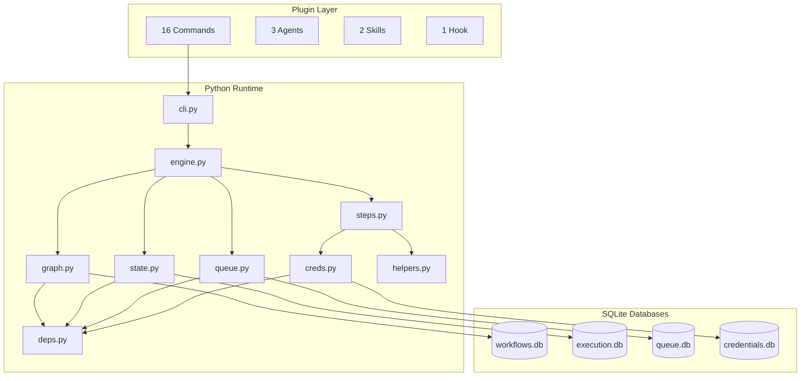

# liteflow Documentation

Workflow automation as a Claude Code plugin. An n8n-lite that requires zero infrastructure.

liteflow turns Claude into a conversational workflow automation platform. The entire system runs on Python + SQLite -- no server, no Docker, no web UI. Install the plugin and you have a running workflow automation engine immediately.

[](https://deepwiki.com/jaredmixpanel/liteflow)

---

## Quick Start

```
claude --plugin-dir /path/to/liteflow
/liteflow:flow-setup
/liteflow:flow-build
```

See [Installation and Setup](getting-started/installation.md) for full instructions.

---

## I Want To...

| Goal | Start Here |
|------|------------|
| Install liteflow and get running | [Installation](getting-started/installation.md) |
| Build my first workflow | [First Workflow](getting-started/first-workflow.md) |
| Use a pre-built template | [Templates](getting-started/templates.md) |
| Store API credentials | [Credentials](getting-started/credentials.md) |
| Schedule a workflow to run automatically | [Scheduling](getting-started/scheduling.md) |
| Understand how the system works | [Architecture](concepts/architecture.md) |
| Look up a step type | [Step Types Reference](reference/step-types/index.md) |
| Look up a command | [Command Reference](reference/commands.md) |
| Debug a failed workflow | [Debugging Guide](guides/debugging-workflows.md) |
| Improve workflow performance | [Optimization Guide](guides/optimizing-workflows.md) |
| Create a reusable template | [Creating Templates](guides/creating-templates.md) |
| Add a new step type or command | [Extending liteflow](guides/extending-liteflow.md) |
| Look up a Python API | [Module Reference](reference/modules/index.md) |

---

## Architecture at a Glance

liteflow has two layers: a **plugin layer** of Markdown files that Claude Code auto-discovers, and a **Python runtime** that executes workflows as DAGs backed by SQLite.



See [Architecture Overview](concepts/architecture.md) for details.

---

## Documentation Map

### [Getting Started](getting-started/installation.md)

For new users building their first workflows.

- [Installation and Setup](getting-started/installation.md) -- install, initialize, verify
- [Building Your First Workflow](getting-started/first-workflow.md) -- create, run, inspect
- [Managing Credentials](getting-started/credentials.md) -- store and use API tokens
- [Scheduling Workflows](getting-started/scheduling.md) -- cron, desktop, cloud, events
- [Using Workflow Templates](getting-started/templates.md) -- morning briefing, PR review, health check

### [Core Concepts](concepts/architecture.md)

Understand how liteflow works under the hood.

- [Architecture Overview](concepts/architecture.md) -- two-layer design, module map, databases
- [Workflows and DAGs](concepts/workflows-and-dags.md) -- graph model, step types, edges
- [The Execution Engine](concepts/execution-engine.md) -- run loop, fan-out/fan-in, error policies
- [Context and Data Flow](concepts/context-and-data-flow.md) -- context accumulation, templates, StepContext

### [Reference](reference/commands.md)

Complete reference documentation for all components.

- [Command Reference](reference/commands.md) -- 16 commands, 3 agents, 2 skills, 1 hook
- [Step Types Reference](reference/step-types/index.md) -- comparison table, step contract
  - [Script, Shell, Claude](reference/step-types/script-shell-claude.md) -- execution step types
  - [Query, HTTP, Transform](reference/step-types/query-http-transform.md) -- data step types
  - [Gate, Fan-Out, Fan-In](reference/step-types/gate-fanout-fanin.md) -- flow control step types
- [Python Module Reference](reference/modules/index.md) -- all classes, functions, signatures

### [Guides](guides/debugging-workflows.md)

Practical guides for common tasks.

- [Debugging Failed Workflows](guides/debugging-workflows.md) -- triage, error catalog, DB queries
- [Optimizing Performance](guides/optimizing-workflows.md) -- parallelism, timeouts, data flow
- [Creating Templates](guides/creating-templates.md) -- template structure and authoring
- [Extending liteflow](guides/extending-liteflow.md) -- new commands, step types, agents

---

## Step Types

| Type | Category | Purpose |
|------|----------|---------|
| [script](reference/step-types/script-shell-claude.md) | Execution | Run a Python file (step contract) |
| [shell](reference/step-types/script-shell-claude.md) | Execution | Run a shell command or .sh script |
| [claude](reference/step-types/script-shell-claude.md) | Execution | LLM reasoning with templated prompt |
| [query](reference/step-types/query-http-transform.md) | Data | SQL against any SQLite database |
| [http](reference/step-types/query-http-transform.md) | Data | HTTP request with auto-auth |
| [transform](reference/step-types/query-http-transform.md) | Data | Python expression for data reshaping |
| [gate](reference/step-types/gate-fanout-fanin.md) | Flow Control | Conditional branching |
| [fan-out](reference/step-types/gate-fanout-fanin.md) | Flow Control | Split array into parallel executions |
| [fan-in](reference/step-types/gate-fanout-fanin.md) | Flow Control | Collect parallel results |

---

## Version

liteflow v0.1.0 -- MIT License
