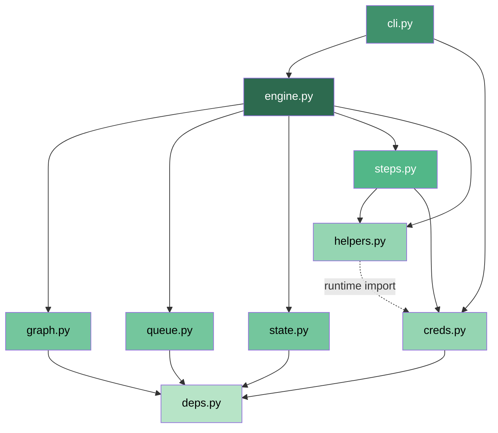

# Python Module Reference

API reference for all 10 Python runtime modules in liteflow's `lib/` directory. Each module's classes, functions, and signatures are documented below with descriptions derived from the source code.

---

## Module Dependency Diagram



**Legend**: Solid arrows are direct imports. The dashed arrow from `helpers.py` to `creds.py` is a runtime import inside `HTTPStep._resolve_url()` to avoid circular dependencies.

---

## Public API (`__init__.py`)

The package exports five primary classes. All other functions and classes are considered internal.

```python
"""liteflow -- DAG-based workflow engine built on Python + SQLite."""

__version__ = "0.1.0"

__all__ = [
    "LiteflowEngine",   # from .engine
    "StepContext",       # from .helpers
    "SecureStore",       # from .creds
    "HTTPStep",          # from .helpers
    "RunLogger",         # from .helpers
]
```

---

## engine.py -- Workflow Execution Engine

### Class: `LiteflowEngine`

The central orchestrator. Reads workflow definitions from the graph database, schedules steps via the execution queue, and tracks results in the state database.

```python
__init__(home_dir: str = "~/.liteflow") -> None
```

Creates or opens the liteflow home directory and initializes paths to the five SQLite databases:

| Database | Attribute | Purpose |
|----------|-----------|---------|
| `workflows.db` | `self.workflows_db` | Graph definitions (workflows, steps, edges) |
| `execution.db` | `self.execution_db` | Run and step_run state tracking |
| `queue.db` | `self.queue_db` | Execution queue (litequeue) |
| `credentials.db` | `self.credentials_db` | Encrypted credential storage |
| `config.db` | `self.config_db` | Configuration settings |

### Public Methods

| Method | Signature | Returns | Description |
|--------|-----------|---------|-------------|
| `setup` | `() -> Dict[str, Any]` | Setup status | Initialize all DBs, install core deps. Returns dict with per-component status and `dep_status` from `check_deps()`. |
| `run_workflow` | `(workflow_id: str, context: Optional[Dict[str, Any]]=None, dry_run: bool=False) -> str` | `run_id` | Execute a workflow. Validates the workflow exists, generates a 12-char hex run_id, enqueues entry steps, and runs `_run_loop`. Raises `ValueError` if workflow not found or has no entry steps. |
| `list_workflows` | `() -> List[Dict[str, Any]]` | Workflow list | All registered workflows with id, name, description, metadata. |
| `get_workflow` | `(workflow_id: str) -> Optional[Dict[str, Any]]` | Workflow def | Full definition with `workflow`, `steps`, and `edges` keys. Returns `None` if not found. |
| `get_history` | `(workflow_id: Optional[str]=None, limit: int=20) -> List[Dict[str, Any]]` | Run records | Execution history, optionally filtered by workflow. Most recent first. |
| `get_run` | `(run_id: str) -> Optional[Dict[str, Any]]` | Run record | Single run record by ID. Returns `None` if not found. |
| `inspect_run` | `(run_id: str) -> Optional[Dict[str, Any]]` | `{run, step_runs, accumulated_context}` | Detailed inspection: the run record, all step_run records (with JSON fields parsed), and the merged accumulated context. |
| `get_status` | `() -> Dict[str, Any]` | Status info | System overview: DB file sizes, queue depth, recent 5 runs, workflow count. |

### Internal Methods

Documented for extension developers. These are called by `run_workflow` and `_run_loop`.

| Method | Signature | Returns | Purpose |
|--------|-----------|---------|---------|
| `_run_loop` | `(run_id: str, dry_run: bool=False) -> None` | `None` | Core dequeue-execute-enqueue loop. Safety limit of 1000 iterations. Handles error policies (`fail`, `retry`, `skip`) per step config. |
| `_handle_fan_out` | `(run_id: str, step_id: str, items: List[Dict[str, Any]], context: Dict[str, Any], logger: RunLogger) -> None` | `None` | Enqueue N copies of each successor step, one per fan-out item. Injects `_fan_out_step`, `_fan_out_total`, and `_fan_out_index` metadata into each item's context. |
| `_check_fan_out_complete` | `(run_id: str, step_id: str, context: Dict[str, Any]) -> Optional[Dict[str, Any]]` | Merged context or `None` | Check if all fan-out items for a step have completed. Returns merged context with `_fan_in_results` list when all done; returns `None` if items are still pending. |
| `_evaluate_edge` | `(edge: Dict[str, Any], context: Dict[str, Any], step_output: Dict[str, Any]) -> bool` | `bool` | Check if an edge's transition condition is met. Supports `when` (true/false/always with gate results) and `expression` (restricted `eval` with `ctx` and context locals). |
| `_all_predecessors_done` | `(run_id: str, target_step_id: str) -> bool` | `bool` | Fan-in predecessor gate. Returns `True` if all inbound predecessors have completed step_runs. Single-predecessor or entry steps always return `True`. |
| `_get_step_config` | `(step_id: str) -> Optional[Dict[str, Any]]` | Step config or `None` | Load step configuration from the graph DB by querying the `nodes` table directly. Only returns nodes with `node_type == "step"`. |

---

## steps.py -- Step Executors

Nine step type executors plus a template helper. All executors share the same signature and return a `Dict[str, Any]`.

### Functions

| Function | Signature | Description |
|----------|-----------|-------------|
| `execute_step` | `(step_config: Dict[str, Any], context: Dict[str, Any], run_id: str, liteflow_home: str) -> Dict[str, Any]` | Dispatch to the correct executor based on `step_config["type"]`. Raises `ValueError` for unknown types. |
| `execute_script` | `(config, context, run_id, liteflow_home) -> Dict[str, Any]` | Run a Python script file. Pipes context as JSON to stdin, captures JSON from stdout. Config: `script` (path), `timeout` (default 300). |
| `execute_shell` | `(config, context, run_id, liteflow_home) -> Dict[str, Any]` | Run a shell command or script file. Sets `LITEFLOW_*` env vars from context. Config: `command` (inline) or `file` + optional `args` list, `timeout` (default 120). |
| `execute_claude` | `(config, context, run_id, liteflow_home) -> Dict[str, Any]` | Send a prompt to Claude via the CLI (`claude -p`). Config: `prompt` (template string), `timeout` (default 120), `parse_json` (default `False`), `flags` (dict of arbitrary CLI flags). |
| `execute_query` | `(config, context, run_id, liteflow_home) -> Dict[str, Any]` | Run SQL against a SQLite database. SELECT returns `{rows, count}`; writes return `{rowcount}`. Config: `database` (path), `sql` (query), `params` (optional list). |
| `execute_http` | `(config, context, run_id, liteflow_home) -> Dict[str, Any]` | Make an HTTP request via `HTTPStep`. Auto-injects auth from `SecureStore`. Config: `method` (default GET), `url`, `endpoint`, `body`, `headers`. |
| `execute_transform` | `(config, context, run_id, liteflow_home) -> Dict[str, Any]` | Evaluate a Python expression with restricted `eval()`. Context, `ctx` (StepContext), and `json` module are available. Safe builtins include `len`, `str`, `int`, `float`, `bool`, `list`, `dict`, `tuple`, `sorted`, `reversed`, `min`, `max`, `sum`, `any`, `all`, `zip`, `enumerate`, `range`, `abs`, `round`. Config: `expression`. |
| `execute_gate` | `(config, context, run_id, liteflow_home) -> Dict[str, Any]` | Evaluate a boolean condition expression. Returns `{"_gate_result": True/False}` for the engine to route edges. Safe builtins: `len`, `str`, `int`, `float`, `bool`, `any`, `all`. Context, `ctx`, and `json` module are available. Config: `condition`. |
| `execute_fan_out` | `(config, context, run_id, liteflow_home) -> Dict[str, Any]` | Take an array from context and produce `_fan_out_items`. Each item is wrapped with `item_key` and `_fan_out_index`. Config: `over` (dot-path to array), `item_key` (default `"item"`). |
| `execute_fan_in` | `(config, context, run_id, liteflow_home) -> Dict[str, Any]` | Collect results from fan-out. Reads `_fan_in_results` from context (populated by the engine). Returns `{results, count}`. Config: `merge_key` (optional, extracts a single key from each result). |
| `_template` | `(text: str, context: Dict[str, Any]) -> str` | Substitute `{variable}` placeholders with context values. Supports dot-path access via `StepContext.get()`. Regex pattern: `\{[a-zA-Z0-9_.:-]+\}`. Unresolved placeholders are left as-is. |

---

## graph.py -- Workflow Graph Management

Module-level functions wrapping `simple-graph-sqlite`. Workflows are stored as directed graphs where nodes represent workflows and steps, and edges represent containment (`contains` type) or transitions (`transition` type).

### Functions

| Function | Signature | Description |
|----------|-----------|-------------|
| `init_graph_db` | `(db_path: str) -> None` | Create or open the graph database and initialize its schema via `simple_graph_sqlite.database.initialize()`. |
| `create_workflow` | `(db_path: str, workflow_id: str, name: str, description: str="", metadata: Optional[Dict[str, Any]]=None) -> None` | Upsert a workflow node. Body includes `id`, `type` ("workflow"), `name`, `description`, `metadata`. |
| `add_step` | `(db_path: str, workflow_id: str, step_id: str, step_config: Dict[str, Any]) -> None` | Add a step node and a `contains` edge from the workflow. Both operations run in a single `atomic()` call. Raises `ValueError` if `step_config` is missing a `type` field. |
| `add_edge` | `(db_path: str, source_step: str, target_step: str, conditions: Optional[Dict[str, Any]]=None) -> None` | Connect two steps with a `transition` edge. Optional `conditions` dict (e.g., `{"when": "true"}`, `{"expression": "..."}`) is stored in edge properties. |
| `get_workflow` | `(db_path: str, workflow_id: str) -> Optional[Dict[str, Any]]` | Returns `{"workflow": {...}, "steps": [...], "edges": [...]}` or `None` if not found. |
| `get_steps` | `(db_path: str, workflow_id: str) -> List[Dict[str, Any]]` | All step nodes connected from the workflow via `contains` edges. |
| `get_edges` | `(db_path: str, workflow_id: str) -> List[Dict[str, Any]]` | All `transition` edges between the workflow's steps. Each edge dict includes `source`, `target`, and any condition properties. |
| `get_successors` | `(db_path: str, step_id: str) -> List[Dict[str, Any]]` | Outbound `transition` edges from a step. |
| `get_predecessors` | `(db_path: str, step_id: str) -> List[Dict[str, Any]]` | Inbound `transition` edges to a step. |
| `get_entry_steps` | `(db_path: str, workflow_id: str) -> List[Dict[str, Any]]` | Steps with no inbound transition edges (DAG start nodes). |
| `delete_workflow` | `(db_path: str, workflow_id: str) -> None` | Remove a workflow node and all its step nodes in a single `atomic()` call. |
| `list_workflows` | `(db_path: str) -> List[Dict[str, Any]]` | All nodes with `type == "workflow"`. Returns an empty list on error. |

---

## state.py -- Execution State Tracking

### Database Schema

**`runs` table**:

| Column | Type | Nullable | Description |
|--------|------|----------|-------------|
| `id` | `str` | No (PK) | Unique run identifier (12-char hex) |
| `workflow_id` | `str` | No | The workflow being executed |
| `status` | `str` | No | `running`, `completed`, `failed`, `cancelled` |
| `started_at` | `str` | No | ISO 8601 UTC timestamp |
| `completed_at` | `str` | Yes | ISO 8601 UTC timestamp |
| `context` | `str` | Yes | JSON-encoded initial context dict |
| `error` | `str` | Yes | Error message if status is `failed` |

**`step_runs` table**:

| Column | Type | Nullable | Description |
|--------|------|----------|-------------|
| `id` | `str` | No (PK) | Unique step_run identifier (12-char hex) |
| `run_id` | `str` | No | Parent run identifier |
| `step_id` | `str` | No | The step being executed |
| `status` | `str` | No | `running`, `completed`, `failed`, `skipped` |
| `started_at` | `str` | No | ISO 8601 UTC timestamp |
| `completed_at` | `str` | Yes | ISO 8601 UTC timestamp |
| `input_context` | `str` | Yes | JSON-encoded context passed to the step |
| `output` | `str` | Yes | JSON-encoded step output dict |
| `error` | `str` | Yes | Error message |
| `attempt` | `int` | Yes | Attempt number (1-based, increments on retry) |

### Functions

| Function | Signature | Description |
|----------|-----------|-------------|
| `init_state_db` | `(db_path: str) -> None` | Create `runs` and `step_runs` tables if they don't exist. |
| `create_run` | `(db_path: str, run_id: str, workflow_id: str, initial_context: Optional[Dict[str, Any]]=None) -> Dict[str, Any]` | Insert a run record with `status="running"`. Returns the created record. |
| `complete_run` | `(db_path: str, run_id: str, status: str="completed", error: Optional[str]=None) -> None` | Update a run's status and `completed_at` timestamp. |
| `get_run` | `(db_path: str, run_id: str) -> Optional[Dict[str, Any]]` | Fetch a run record by ID. Returns `None` if not found. |
| `get_runs` | `(db_path: str, workflow_id: Optional[str]=None, limit: int=20) -> List[Dict[str, Any]]` | List recent runs ordered by `started_at` descending. Optional workflow filter. |
| `create_step_run` | `(db_path: str, run_id: str, step_id: str, input_context: Optional[Dict[str, Any]]=None) -> str` | Insert a step_run record with `status="running"`. Auto-increments `attempt` based on existing records for the same run+step. Returns the generated step_run ID. |
| `complete_step_run` | `(db_path: str, run_id: str, step_id: str, status: str, output: Optional[Dict[str, Any]]=None, error: Optional[str]=None) -> None` | Update the most recent running step_run for the given run+step. |
| `get_step_runs` | `(db_path: str, run_id: str) -> List[Dict[str, Any]]` | All step_run records for a run, ordered by `started_at`. |
| `get_run_context` | `(db_path: str, run_id: str) -> Dict[str, Any]` | Build accumulated context: starts with the run's initial context, then merges each completed step's output under its `step_id` key. |

---

## queue.py -- Execution Queue

Persistent FIFO queue backed by SQLite via `litequeue`. Provides visibility timeouts and dead-letter handling.

### Functions

| Function | Signature | Description |
|----------|-----------|-------------|
| `init_queue` | `(db_path: str) -> None` | Create or open the queue database. |
| `enqueue` | `(db_path: str, step_id: str, run_id: str, context: Optional[Dict[str, Any]]=None) -> None` | Put a step execution message on the queue. Message payload: `{"step_id": ..., "run_id": ..., "context": ...}`. |
| `dequeue` | `(db_path: str) -> Optional[Tuple[str, Dict[str, Any]]]` | Pop the next message. Locks it so other consumers won't receive it. Returns `(message_id, payload_dict)` or `None` if empty. |
| `acknowledge` | `(db_path: str, message_id: str) -> None` | Mark a message as successfully processed. |
| `nack` | `(db_path: str, message_id: str) -> None` | Return a locked message to the queue for retry. |
| `queue_size` | `(db_path: str) -> int` | Number of pending messages. |
| `dead_letters` | `(db_path: str) -> List[Dict[str, Any]]` | Messages that have been marked as failed. Each entry has `message_id` and `payload`. |
| `clear_queue` | `(db_path: str) -> None` | Drain all pending messages and prune completed/failed entries. |

---

## creds.py -- Credential Management

### Class: `SecureStore`

Encrypted credential storage backed by `sqlitedict`. Uses Fernet symmetric encryption when the `cryptography` package is available; falls back to base64 obfuscation with a warning otherwise.

```python
__init__(db_path: str = "~/.liteflow/credentials.db") -> None
```

### Methods

| Method | Signature | Description |
|--------|-----------|-------------|
| `set_token` | `(service: str, token: str, metadata: Optional[Dict[str, Any]]=None) -> None` | Store an encrypted API token. Metadata can include `scopes`, description, etc. Records `added_at` timestamp and `base_url` from `SERVICE_URLS`. |
| `get_token` | `(service: str) -> Optional[str]` | Decrypt and retrieve a token. Returns `None` if not found. |
| `set_credential` | `(service: str, cred: Dict[str, Any]) -> None` | Store a full credential bundle. Encrypts the `token` field if present. |
| `get_credential` | `(service: str) -> Optional[Dict[str, Any]]` | Retrieve a full credential bundle with the `token` field decrypted. |
| `list_services` | `() -> List[str]` | Sorted list of all stored service names. |
| `remove` | `(service: str) -> None` | Delete credentials for a service. |
| `test_credential` | `(service: str) -> Dict[str, Any]` | Test validity with a lightweight API call. Returns `{"valid": bool, "message": str}`. Uses service-specific endpoints (e.g., `/user` for GitHub, `/auth.test` for Slack). |

### Constants

**`SERVICE_URLS`** -- Base URLs for 8 built-in service integrations:

| Service | Base URL |
|---------|----------|
| `github` | `https://api.github.com` |
| `slack` | `https://slack.com/api` |
| `jira` | `https://your-domain.atlassian.net/rest/api/3` |
| `notion` | `https://api.notion.com/v1` |
| `linear` | `https://api.linear.app/graphql` |
| `sendgrid` | `https://api.sendgrid.com/v3` |
| `openai` | `https://api.openai.com/v1` |
| `anthropic` | `https://api.anthropic.com/v1` |

### Encryption

- **Primary**: Fernet symmetric encryption (requires the `cryptography` package). Key is derived via `SHA256(platform.node())`, then base64-encoded to meet Fernet's 32-byte key requirement.
- **Fallback**: Base64 encoding with XOR obfuscation using the same derived key. A warning is emitted when falling back.

---

## helpers.py -- Utility Classes

### Class: `StepContext`

Wraps a raw context dict with dot-path access and merging.

```python
__init__(raw: Optional[Dict[str, Any]] = None) -> None
```

| Method | Signature | Description |
|--------|-----------|-------------|
| `get` | `(dotpath: str, default: Any=None) -> Any` | Dot-path access into nested dicts and lists. E.g., `"github.issues.0.title"` traverses dict keys and integer list indices. Returns `default` if any segment is not found. |
| `require` | `(*keys: str) -> None` | Validate that all dot-paths resolve to non-`None` values. Raises `KeyError` listing missing keys and available top-level keys. |
| `merge` | `(step_id: str, output: Dict[str, Any]) -> None` | Merge a step's output into the context, namespaced under `step_id`. |
| `to_dict` | `() -> Dict[str, Any]` | Export the underlying data as a plain dict. |

### Class: `HTTPStep`

Minimal HTTP client built on `urllib` with zero extra dependencies. Supports automatic auth header injection when paired with a `SecureStore`.

```python
__init__(auth_store: Any = None) -> None
```

| Method | Signature | Description |
|--------|-----------|-------------|
| `get` | `(url_or_service: str, endpoint: str="", headers: Optional[Dict[str, str]]=None, params: Optional[Dict[str, str]]=None) -> Dict[str, Any]` | HTTP GET. Query params are URL-encoded and appended. |
| `post` | `(url_or_service: str, data: Any=None, endpoint: str="", headers: Optional[Dict[str, str]]=None) -> Dict[str, Any]` | HTTP POST. Body is JSON-encoded. |
| `put` | `(url_or_service: str, data: Any=None, endpoint: str="", headers: Optional[Dict[str, str]]=None) -> Dict[str, Any]` | HTTP PUT. Body is JSON-encoded. |
| `delete` | `(url_or_service: str, endpoint: str="", headers: Optional[Dict[str, str]]=None) -> Dict[str, Any]` | HTTP DELETE. |

**URL resolution**: If `url_or_service` starts with `http://` or `https://`, it is used directly. Otherwise it is treated as a service name and resolved via the auth store's `get_credential()` or `SERVICE_URLS`.

**Auth injection** (`_inject_auth`): Automatically adds `Authorization` headers for known services. GitHub uses `token <token>`, Anthropic uses `x-api-key`, all others use `Bearer <token>`. Skipped if the URL is already a full URL or an `Authorization` header is already set.

### Class: `RunLogger`

Structured logging to stderr and optional execution database storage.

```python
__init__(run_id: str, step_id: str, db_path: Optional[str] = None) -> None
```

| Method | Signature | Description |
|--------|-----------|-------------|
| `info` | `(message: str, data: Any=None) -> None` | Log an informational message. Prints `[INFO ] [step_id] message` to stderr. |
| `warn` | `(message: str, data: Any=None) -> None` | Log a warning. Prints `[WARN ] [step_id] message` to stderr. |
| `error` | `(message: str, data: Any=None) -> None` | Log an error. Prints `[ERROR] [step_id] message` to stderr. |
| `get_logs` | `() -> List[Dict[str, Any]]` | Return all accumulated log entries. Each entry has `timestamp`, `level`, `run_id`, `step_id`, `message`, and optional `data`. |

---

## deps.py -- Dependency Management

### Constants

**`CORE_DEPS`** -- Required SQLite libraries installed during setup:

```python
["simple-graph-sqlite", "litequeue", "sqlite-utils", "sqlitedict"]
```

**`OPTIONAL_SDKS`** -- Service-to-package mapping for lazy SDK installation:

| Service | Package |
|---------|---------|
| `github` | `PyGithub` |
| `slack` | `slack_sdk` |
| `jira` | `jira` |
| `notion` | `notion-client` |
| `linear` | `linear-python` |
| `sendgrid` | `sendgrid` |
| `twilio` | `twilio` |
| `gcp` | `google-cloud-core` |
| `openai` | `openai` |
| `anthropic` | `anthropic` |

### Functions

| Function | Signature | Description |
|----------|-----------|-------------|
| `ensure_deps` | `(*packages: str) -> None` | Install missing packages silently via `pip install -q`. Converts hyphens to underscores for the import check. |
| `ensure_sdk` | `(service: str) -> None` | Install the optional SDK for a service name. Raises `ValueError` if the service name is not in `OPTIONAL_SDKS`. |
| `check_deps` | `() -> Dict[str, Dict[str, bool]]` | Check installation status for all known dependencies. Returns `{"core": {"pkg": bool, ...}, "optional": {"service": bool, ...}}`. |

---

## cli.py -- CLI Interface

Entry point for the command-line interface, invoked by Claude Code plugin commands via `python -m lib.cli <subcommand>`.

### Entry Point

```python
def main() -> None
```

Uses `argparse` with subcommands. All output is JSON to stdout via `_output()`. Errors print JSON `{"error": message}` and exit with code 1.

### Subcommands

| Subcommand | Handler | Arguments | Description |
|------------|---------|-----------|-------------|
| `setup` | `cmd_setup` | (none) | Initialize databases and install dependencies. |
| `run` | `cmd_run` | `workflow_id`, `--context '{}'`, `--dry-run` | Execute a workflow. Prints run_id and full inspection. |
| `list` | `cmd_list` | (none) | List all workflows with count. |
| `show` | `cmd_show` | `workflow_id` | Show full workflow definition. |
| `history` | `cmd_history` | `--workflow`, `--limit 20` | Show execution history. |
| `inspect` | `cmd_inspect` | `run_id` | Detailed run inspection with step results. |
| `status` | `cmd_status` | `--quiet` | System status. In quiet mode, only outputs when queue has items. |
| `auth` | `cmd_auth` | `action` {set,get,list,remove,test}, `--service`, `--token`, `--metadata '{}'` | Manage credentials. Token is redacted in `get` output. |

---

## Cross-references

- [Architecture](../../concepts/architecture.md) -- high-level architecture and execution model
- [Step Types](../step-types/index.md) -- step type configuration reference
- [Commands](../commands.md) -- plugin command reference
- [Documentation Home](../../index.md) -- docs home
