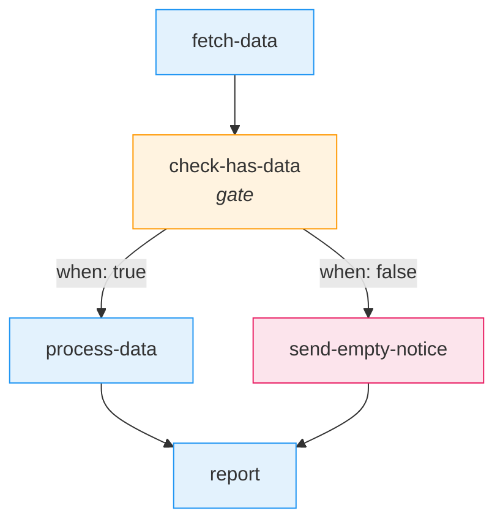
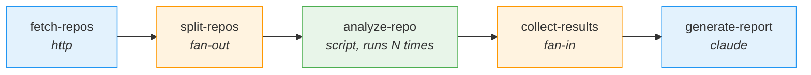
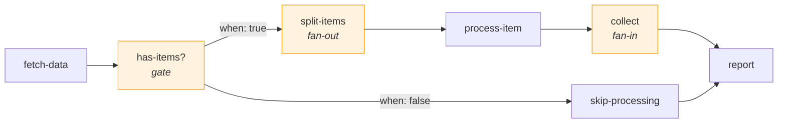

# Gate, Fan-Out, and Fan-In Steps

The three "flow control" step types handle conditional branching and parallel processing within a workflow DAG. Unlike execution steps (script, shell, claude) that perform work, or data steps (query, http, transform) that fetch and reshape data, these steps control *which* steps run and *how many times* they run.

- **Gate** evaluates a boolean condition and routes execution down one of two branches.
- **Fan-out** takes an array and spawns parallel copies of the next step, one per item.
- **Fan-in** collects results from all parallel copies after they complete.

---

## Gate Step

A gate step evaluates a Python boolean expression against the current context and produces a `_gate_result` that the engine uses to decide which outbound edges to follow.

### Config Fields

| Field | Type | Required | Default | Description |
|-------|------|----------|---------|-------------|
| `type` | string | yes | -- | Must be `"gate"` |
| `condition` | string | yes | -- | Python boolean expression evaluated against context |

### Eval Environment

The gate condition runs in a restricted `eval()` with the same sandboxed scope used by transform steps. The following are available:

**Safe builtins**: `len`, `str`, `int`, `float`, `bool`, `any`, `all`, `True`, `False`, `None`

**Modules**: `json`

**Locals**: all top-level context keys are injected as local variables, plus two special names:
- `context` -- the full context dict
- `ctx` -- a `StepContext` wrapper providing dot-path access via `ctx.get("step-id.nested.key")`

No other builtins are available. File I/O, imports, and attribute access on arbitrary objects are blocked.

Note that the gate eval scope is smaller than the transform eval scope. Gates have access to `len`, `str`, `int`, `float`, `bool`, `any`, `all`, `True`, `False`, `None`, and `json`. Transforms additionally include `list`, `dict`, `tuple`, `sorted`, `reversed`, `min`, `max`, `sum`, `zip`, `enumerate`, `range`, `abs`, and `round`.

### Output

A gate step always returns exactly one of:

```json
{"_gate_result": true}
```

```json
{"_gate_result": false}
```

The condition expression is coerced to a boolean via `bool()`, so any truthy/falsy Python value works.

### Edge Routing

Edges leaving a gate step use the `when` condition in the edge's `conditions` dict to decide whether to follow:

| `when` value | Edge is followed if... |
|---|---|
| `"true"` | `_gate_result` is `true` |
| `"false"` | `_gate_result` is `false` |
| `"always"` | Always (unconditional) |

If `when` is present and the gate result does not match, the edge is **not** followed. If no `conditions` dict is present on an edge, it is always followed (standard behavior for any step type).

### Example

```json
{
  "id": "check-has-data",
  "type": "gate",
  "condition": "len(context.get('fetch-data', {}).get('rows', [])) > 0"
}
```

Edges from this gate:

```json
{"from": "check-has-data", "to": "process-data", "conditions": {"when": "true"}}
```

```json
{"from": "check-has-data", "to": "send-empty-notice", "conditions": {"when": "false"}}
```

The first edge is followed only when data exists. The second is followed only when the result set is empty.

### Gate Branching Pattern



Both branches converge at `report`. The engine's predecessor gating ensures `report` is not enqueued until whichever branch was taken has completed (see [Execution Engine -- Predecessor Gating](../../concepts/execution-engine.md#predecessor-gating)).

### Condition Patterns

```python
# Simple key check
"context.get('approval') == 'approved'"

# Numeric threshold
"ctx.get('fetch-data.count', default=0) > 10"

# List emptiness
"len(context.get('results', {}).get('items', [])) > 0"

# Boolean flag
"bool(context.get('skip_notification'))"

# String match
"context.get('environment') == 'production'"

# Any/all over a list
"all(r.get('status') == 'pass' for r in context.get('checks', {}).get('rows', []))"
```

---

## Fan-Out Step

A fan-out step takes an array from the context and splits it into parallel executions. The step itself just identifies the items; the **engine** handles the actual parallelization.

### Config Fields

| Field | Type | Required | Default | Description |
|-------|------|----------|---------|-------------|
| `type` | string | yes | -- | Must be `"fan-out"` |
| `over` | string | yes | -- | Dot-path to an array in context, resolved via `StepContext.get()` |
| `item_key` | string | no | `"item"` | Key name under which each item is placed in the child context |

### How It Works

**What the step does** (in `steps.py`):

1. Resolves the `over` dot-path via `StepContext.get()` (e.g., `"fetch-repos.repos"` traverses `context["fetch-repos"]["repos"]`).
2. Validates the result is a `list` or `tuple`. Raises `ValueError` if the path is not found or the value is not iterable.
3. Returns `{"_fan_out_items": [{item_key: item, "_fan_out_index": i}, ...]}`.

**What the engine does** (in `engine.py`, `_handle_fan_out()`):

4. Detects `_fan_out_items` in the step output.
5. Looks up all successor edges of the fan-out step.
6. For each successor, for each item in `_fan_out_items`:
   - Creates a **copy** of the current context.
   - Merges the item data into the copy (the `item_key` value and `_fan_out_index`).
   - Adds tracking metadata:
     - `_fan_out_step`: the ID of the fan-out step
     - `_fan_out_total`: total number of items
     - `_fan_out_index`: this item's zero-based index
   - Enqueues the successor step with this per-item context.

### Context Metadata

Each fanned-out copy receives these keys in its context:

| Key | Type | Description |
|-----|------|-------------|
| `_fan_out_step` | string | ID of the fan-out step that spawned this execution |
| `_fan_out_total` | int | Total number of items being processed in parallel |
| `_fan_out_index` | int | This item's position in the array (0-based) |
| *(item_key)* | any | The item value itself, under the configured `item_key` name |

### Example

```json
{
  "id": "split-repos",
  "type": "fan-out",
  "over": "fetch-repos.repos",
  "item_key": "repo"
}
```

If `context["fetch-repos"]["repos"]` is `["owner/repo1", "owner/repo2", "owner/repo3"]`, the engine enqueues 3 copies of the next step. Each copy's context includes:

**Copy 0:**
```json
{
  "repo": "owner/repo1",
  "_fan_out_step": "split-repos",
  "_fan_out_total": 3,
  "_fan_out_index": 0
}
```

**Copy 1:**
```json
{
  "repo": "owner/repo2",
  "_fan_out_step": "split-repos",
  "_fan_out_total": 3,
  "_fan_out_index": 1
}
```

**Copy 2:**
```json
{
  "repo": "owner/repo3",
  "_fan_out_step": "split-repos",
  "_fan_out_total": 3,
  "_fan_out_index": 2
}
```

(Plus all prior context keys from the workflow -- `fetch-repos`, initial context, etc.)

---

## Fan-In Step

A fan-in step collects results from all parallel fan-out executions into a single array for downstream processing.

### Config Fields

| Field | Type | Required | Default | Description |
|-------|------|----------|---------|-------------|
| `type` | string | yes | -- | Must be `"fan-in"` |
| `merge_key` | string | no | `null` | Optional key to extract from each result dict |

### How It Works

**What the engine does** (in `engine.py`, `_check_fan_out_complete()`):

1. After each fanned-out step copy completes, the engine checks whether all copies are done by counting completed `step_runs` for that step against `_fan_out_total`.
2. While copies are still running, the engine does nothing -- it waits.
3. When all copies have completed:
   - Collects each completed step_run's output dict into a list.
   - Builds a merged context with `_fan_in_results` set to the collected outputs array.
   - Strips fan-out metadata (`_fan_out_step`, `_fan_out_total`, `_fan_out_index`) from the context.
   - Enqueues successor steps (including the fan-in step) with this merged context.

**What the step does** (in `steps.py`):

4. Reads `_fan_in_results` from the context (populated by the engine).
5. If `merge_key` is specified, extracts that key from each result dict. If a result is not a dict or lacks the key, the full result is included as-is.
6. Returns `{"results": [...], "count": N}`.

### Example

```json
{
  "id": "collect-analyses",
  "type": "fan-in",
  "merge_key": "summary"
}
```

If `_fan_in_results` in context is:
```json
[
  {"summary": "Repo1 is healthy", "score": 95},
  {"summary": "Repo2 needs fixes", "score": 60}
]
```

**With `merge_key: "summary"`:**
```json
{"results": ["Repo1 is healthy", "Repo2 needs fixes"], "count": 2}
```

**Without `merge_key`:**
```json
{
  "results": [
    {"summary": "Repo1 is healthy", "score": 95},
    {"summary": "Repo2 needs fixes", "score": 60}
  ],
  "count": 2
}
```

---

## Complete Fan-Out/Fan-In Pattern

This section walks through a full example: fetching a list of repositories, analyzing each one in parallel, collecting the results, and generating a report.

### Workflow Diagram



### Step Definitions

```json
[
  {
    "id": "fetch-repos",
    "type": "http",
    "method": "GET",
    "url": "github",
    "endpoint": "/user/repos?per_page=3"
  },
  {
    "id": "split-repos",
    "type": "fan-out",
    "over": "fetch-repos.repos",
    "item_key": "repo"
  },
  {
    "id": "analyze-repo",
    "type": "script",
    "script": "steps/repo-health/analyze.py"
  },
  {
    "id": "collect-results",
    "type": "fan-in",
    "merge_key": "status"
  },
  {
    "id": "generate-report",
    "type": "claude",
    "prompt": "Summarize these repository health checks:\n{collect-results.results}\n\nTotal repos checked: {collect-results.count}"
  }
]
```

### Step-by-Step Data Flow

**1. `fetch-repos`** (http step) calls the GitHub API and returns:

```json
{"repos": ["owner/repo1", "owner/repo2", "owner/repo3"]}
```

Context now contains `{"fetch-repos": {"repos": ["owner/repo1", "owner/repo2", "owner/repo3"]}}`.

**2. `split-repos`** (fan-out step) resolves `fetch-repos.repos` and produces:

```json
{
  "_fan_out_items": [
    {"repo": "owner/repo1", "_fan_out_index": 0},
    {"repo": "owner/repo2", "_fan_out_index": 1},
    {"repo": "owner/repo3", "_fan_out_index": 2}
  ]
}
```

**3. The engine** enqueues `analyze-repo` three times, each with per-item context:
- Copy 0: `repo = "owner/repo1"`, `_fan_out_index = 0`, `_fan_out_total = 3`, `_fan_out_step = "split-repos"`
- Copy 1: `repo = "owner/repo2"`, `_fan_out_index = 1`, ...
- Copy 2: `repo = "owner/repo3"`, `_fan_out_index = 2`, ...

**4. Each `analyze-repo`** runs independently. Each returns something like:

```json
{"status": "healthy", "issues": [], "score": 95}
```

After each completes, the engine checks if all 3 are done.

**5. When all 3 complete**, the engine collects their outputs into `_fan_in_results`, strips fan-out metadata, and enqueues `collect-results`:

```json
{
  "_fan_in_results": [
    {"status": "healthy", "issues": [], "score": 95},
    {"status": "needs-fixes", "issues": ["outdated deps"], "score": 60},
    {"status": "healthy", "issues": [], "score": 88}
  ]
}
```

**6. `collect-results`** (fan-in step) with `merge_key: "status"` extracts the status from each result:

```json
{"results": ["healthy", "needs-fixes", "healthy"], "count": 3}
```

**7. `generate-report`** (claude step) sees all collected data in context and produces the final report.

---

## Edge Cases

### Empty Array

If the fan-out `over` path resolves to an empty list (`[]`), the fan-out step raises a `ValueError` because the result is a valid list, but `_handle_fan_out()` will produce zero items. No successor steps are enqueued, and the workflow may stall since the engine loop exits when the queue is empty.

**Mitigation**: Place a gate step before the fan-out to check that the array is non-empty:



### Partial Failures

If some fanned-out copies fail (and the error policy is not `"skip"`), the workflow fails. The engine will not proceed to the fan-in step because `_check_fan_out_complete()` waits for all copies to reach `completed` status.

For non-critical items, set `on_error: "skip"` on the processing step:

```json
{
  "id": "analyze-repo",
  "type": "script",
  "script": "steps/repo-health/analyze.py",
  "on_error": "skip"
}
```

With `"skip"`, failed items are marked as failed but successors are still enqueued. However, note that skipped items will not have output collected into `_fan_in_results`, so the fan-in count may be less than the fan-out total.

### Multiple Successors

A fan-out step can have multiple successor edges. Each successor receives N copies (one per item). This means if `split-repos` fans out 3 items and has 2 successors (`analyze-code` and `check-deps`), the engine enqueues 6 total step executions (3 per successor).

### Path Not Found

If the fan-out `over` dot-path resolves to `None` (the path does not exist in context), the step raises `ValueError: Fan-out path '<path>' not found in context`. Ensure the upstream step has completed and its output is structured as expected.

### Non-List Value

If the fan-out `over` dot-path resolves to a value that is not a list or tuple (e.g., a string or dict), the step raises `ValueError: Fan-out path '<path>' must be a list, got <type>`.

---

## See Also

- [Step Types Overview](index.md) -- summary of all step types
- [Script, Shell, and Claude Steps](script-shell-claude.md) -- execution step types
- [Query, HTTP, and Transform Steps](query-http-transform.md) -- data step types
- [Execution Engine](../../concepts/execution-engine.md) -- the engine's fan-out/fan-in handling, edge evaluation, and predecessor gating
- [Context and Data Flow](../../concepts/context-and-data-flow.md) -- fan-out context metadata and template substitution
- [Documentation Home](../../index.md)
