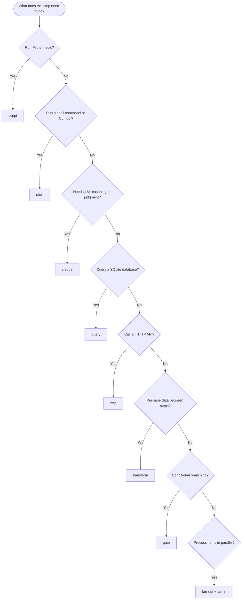

# Step Types Reference

liteflow provides 9 step types organized into three categories: Execution, Data, and Flow Control. Each type is a specialized executor in `steps.py` that the engine dispatches to based on the step's `type` field.

---

## Step Type Comparison

| Type | Category | Purpose | Config Complexity |
|------|----------|---------|-------------------|
| [script](script-shell-claude.md#script) | Execution | Run a Python file following the step contract | Low (just `script` path) |
| [shell](script-shell-claude.md#shell) | Execution | Run a shell command or .sh script file | Low-Medium (`command` OR `file` + `args`) |
| [claude](script-shell-claude.md#claude) | Execution | LLM reasoning with templated prompt | Medium (`prompt` + optional `flags`, `parse_json`) |
| [query](query-http-transform.md#query) | Data | SQL against any SQLite database | Low (`database` + `sql`) |
| [http](query-http-transform.md#http) | Data | HTTP request with auto-auth injection | Medium (`url` + `method`, `headers`, `body`) |
| [transform](query-http-transform.md#transform) | Data | Pure data transformation via Python eval | Low (just `expression`) |
| [gate](gate-fanout-fanin.md#gate) | Flow Control | Conditional branch point via Python eval | Low (just `condition`) |
| [fan-out](gate-fanout-fanin.md#fan-out) | Flow Control | Split array into parallel step executions | Low (`over` dot-path + `item_key`) |
| [fan-in](gate-fanout-fanin.md#fan-in) | Flow Control | Collect results from parallel executions | Low (optional `merge_key`) |

---

## The Step Contract

Every Python step script follows this contract -- read JSON from stdin, return a dict, write JSON to stdout:

```python
import json
import sys

def run(context: dict) -> dict:
    """Receive accumulated context, return output dict.

    Args:
        context: All prior step outputs merged under their step IDs,
                 plus the initial run context.

    Returns:
        Dict that will be merged into context under this step's ID.

    Raises:
        Exception to signal failure (engine captures traceback).
    """
    # Your logic here
    return {"result": "value"}

if __name__ == "__main__":
    ctx = json.loads(sys.stdin.read()) if not sys.stdin.isatty() else {}
    output = run(ctx)
    json.dump(output, sys.stdout)
```

Key points:

- **Input.** Context delivered via stdin as JSON.
- **Output.** Return value is a dict, serialized as JSON to stdout.
- **Errors.** Raise any exception to signal failure -- the engine captures the traceback and applies the step's error policy.
- **No framework dependency.** Pure Python with JSON I/O. Steps have zero imports from liteflow itself.

---

## Testing Steps Independently

Any step can be tested outside a workflow. Because the contract is just JSON in / JSON out, you can exercise a step from the command line:

```bash
# Test with empty context
echo '{}' | python3 my_step.py

# Test with specific context
echo '{"user": "jared", "fetch-data": {"rows": [{"id": 1}]}}' | python3 my_step.py

# Test with context from a previous run (using jq to extract)
python3 -m lib.cli inspect <run-id> | jq '.accumulated_context' | python3 my_step.py
```

This makes steps easy to develop and debug in isolation before wiring them into a DAG.

---

## Choosing the Right Step Type

Use this decision tree to pick the step type that fits your task:



---

## Universal Step Configuration

These fields are available on **all** step types, regardless of category:

| Field | Type | Required | Description |
|-------|------|----------|-------------|
| `id` | string | Yes | Unique step identifier within the workflow. Used as the key when merging output into context. |
| `type` | string | Yes | One of the 9 types: `script`, `shell`, `claude`, `query`, `http`, `transform`, `gate`, `fan-out`, `fan-in`. |
| `on_error` | string | No | Error policy: `"fail"` (default), `"retry"`, or `"skip"`. |
| `max_retries` | int | No | Maximum retry attempts when `on_error` is `"retry"`. Default: 3. |

Beyond these universal fields, each step type has its own configuration options documented in the detail pages linked below.

---

## Detail Pages

- **[Execution Steps: script, shell, claude](script-shell-claude.md)** -- Steps that run code, commands, or LLM prompts to produce results.
- **[Data Steps: query, http, transform](query-http-transform.md)** -- Steps that fetch, request, or reshape data.
- **[Flow Control Steps: gate, fan-out, fan-in](gate-fanout-fanin.md)** -- Steps that control execution flow through conditions and parallelism.

---

## See Also

- [Context and Data Flow](../../concepts/context-and-data-flow.md) -- How context accumulates and template substitution works.
- [Workflows and DAGs](../../concepts/workflows-and-dags.md) -- The DAG model that connects steps via transitions.
- [Documentation Home](../../index.md)
